# Linux Practice : Processes and services 
practice Linux fundamentals with real commands**.
Topics:
- Check running processes
- Inspect one systemd service 
- Log checks
- Mini troubleshooting steps

# Process commands :- 
1) ps      - Displays a snapshot of currently running process.

2) ps aux  - Command widely used to check the details      information of all running processes on system.
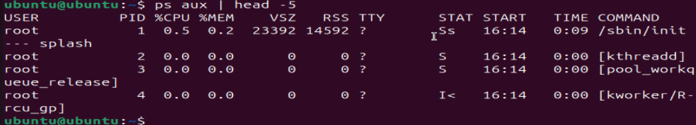
3) top     - Command widely used to show the real-time process monitoring and system performance metric such as CPU,Memory utilization,load average and active processes.
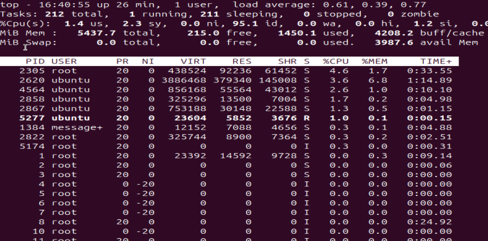
4) htop    - Displays processes in a tree view for better hierarchy visualization and it continously refresh data at specified intervals.
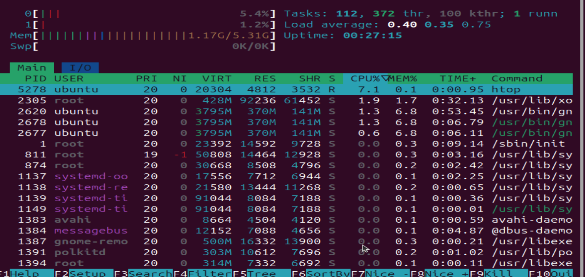
5) free   - Command used to show the system memory utilization.
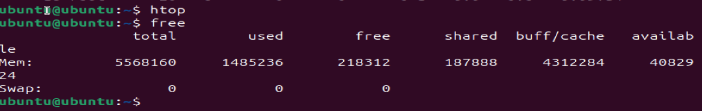

# using systemctl - Inspect one systemd service
1) systemctl status ssh cron - This command used to check the status of the service on system. 
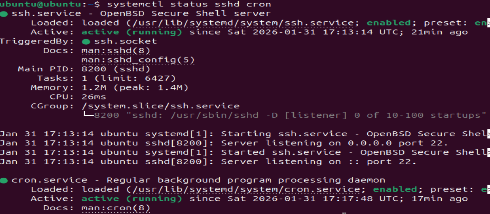
2) systemctl start/stop/enable/restart ssh - this command used to start,stop,enable,restart the running service on system. 
3) systemctl list-units - command is used in Linux systems to display all loaded systemd units, such as services, sockets, devices, and more. It provides details about their current state, making it a powerful tool for managing and monitoring system processes.

# Log check (In DevOps Losg are the best friend) :-
Log File	Description
/var/log/syslog	Records general system activity logs.
/var/log/auth.log	Contains authentication and login attempt information.
/var/log/kern.log	Logs kernel-related messages.
/var/log/boot.log	Stores boot-time events and errors.
/var/log/dmesg	Contains hardware and driver initialization messages.
/var/log/cron.log	Stores scheduled task execution details.
/var/log/secure	Tracks security-related messages and sudo activities.
/var/log/messages	General system messages (used in Red Hat-based systems). 
1) journalctl -u ssh | head -n 50 - The journalctl command is used to view logs collected by the systemd journal.
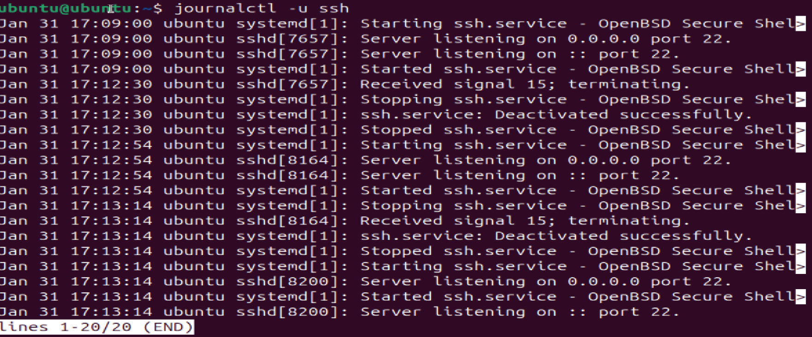

## Small troubleshooting flow on ssh service :- 
- ps aux | grep ssh -- Check running process 
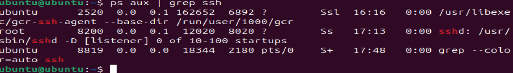 
- systemctl status ssh - Check the service status
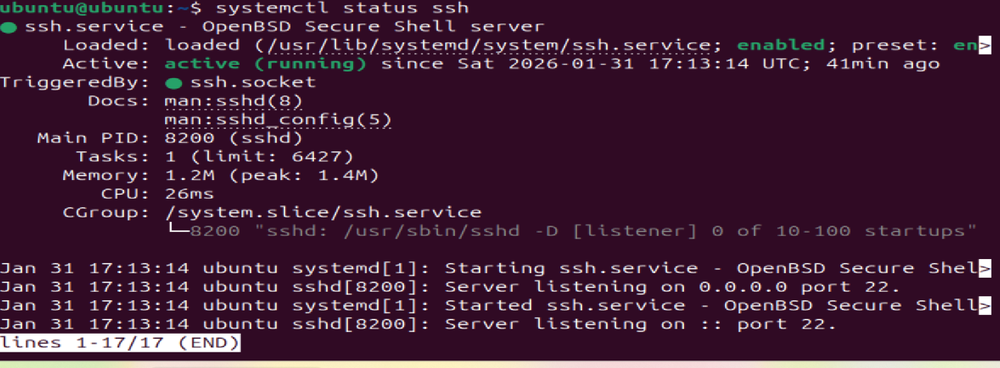
- systemctl start ssh - If in inactive state then start the service
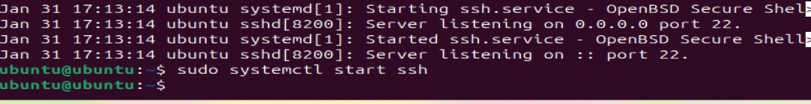
- journalctl -u ssh - Checl the logds of the service.
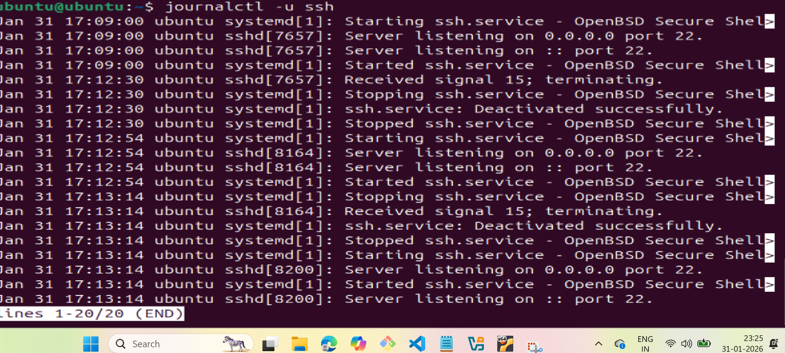
- systemctl is-enabled ssh - Check it enabled at boot 
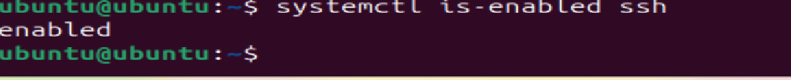
- sudo journalctl -u ssh | grep 22 - Check service listening to port 22
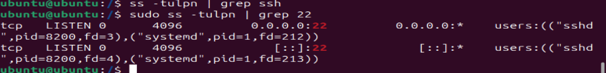