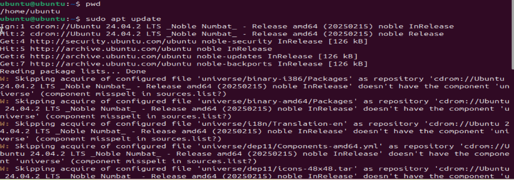
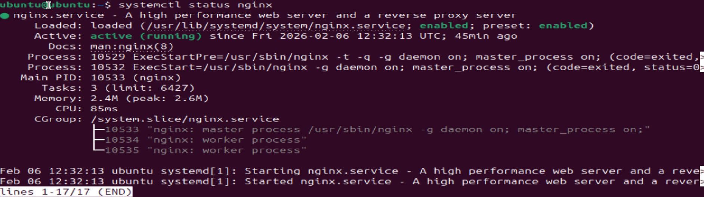
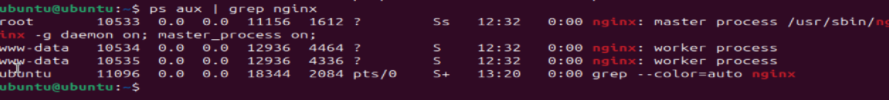
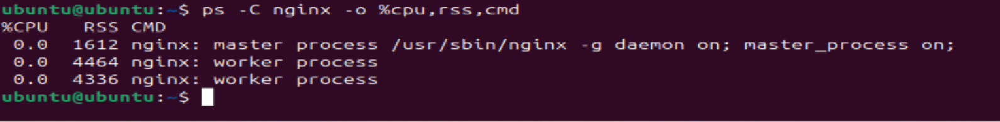
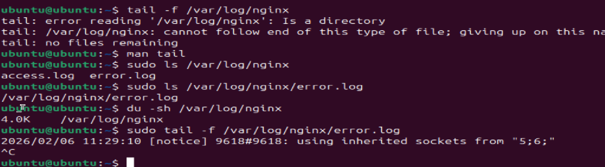
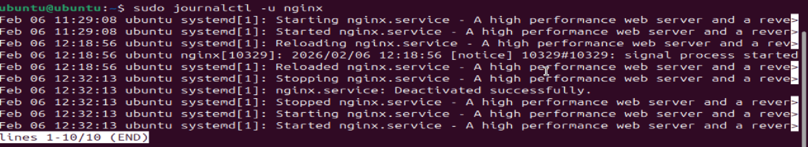

## Linux Troubleshooting Drill: CPU, Memory, and Logs
> Capture a quick health snapshot (CPU, memory, disk, network)
> Trace logs for that service
> Write a mini runbook describing what you did and what you’d do next if things were worse

## Steps:
1.Install nginx service 
2.Check CPU,Memory and Disk usages
3.Check logs in /var/log/nginx
4.Check nginx service healt (systemctl)
5.Check systemd log (using systemctl)
6.Check test Nginx configuration files 

1.Install nginx 
#Sudo apt update    

#sudo apt install nginx -y 

#systemctl status nginx 

If system is in inactive state the use below commands to enable and active the service/package
#systemctl start/enable nginx

2.Check cpu, memory and Disk usages
#ps aux | grep nginx

#ps -C nginx -o %cpu,%mem,cmd 

#ps -C nginx -o %cpu,rss,cmd (check memory usages)

#du -sh /var/log/nginx

pid: Process ID.
user: User owning the process.
rss: Resident Set Size in kilobytes.
comm: Command or process name

3.Check log (Error logs & access logs)
#sudo tail -f /var/log/nginx/error.log
#sudo tail -f /var/log/nginx/access.log

4.Systemd service logs
#sudo journalctl -u nginx --since "1 hour ago"
#sudo journalctl -u nginx

5.Network connections
#ss -tulnp | grep nginx
#netstat -an | grep :80 | wc -l

6.Check test Nginx configuration files
#sudo nginx -t

## What I checked

Verified nginx service status
→ systemctl status nginx

Checked CPU & memory usage
→ top, free -h

Verified disk space
→ df -h

Reviewed nginx logs
→ /var/log/nginx/error.log

Validated nginx config
→ nginx -t
