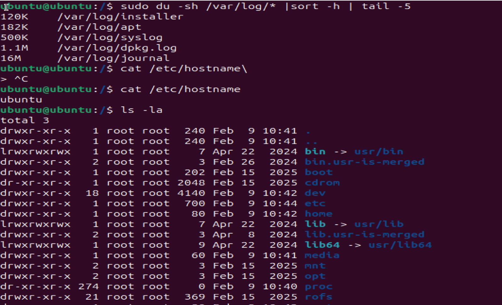
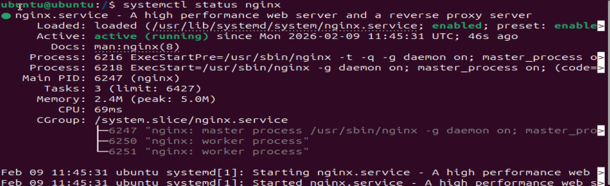
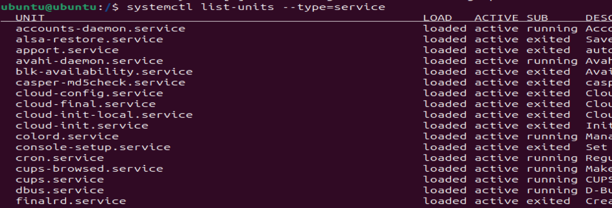
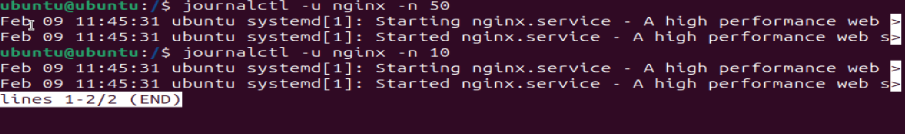
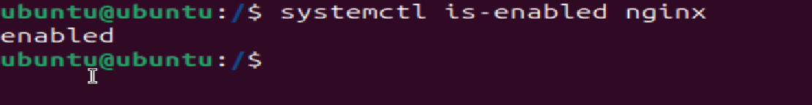
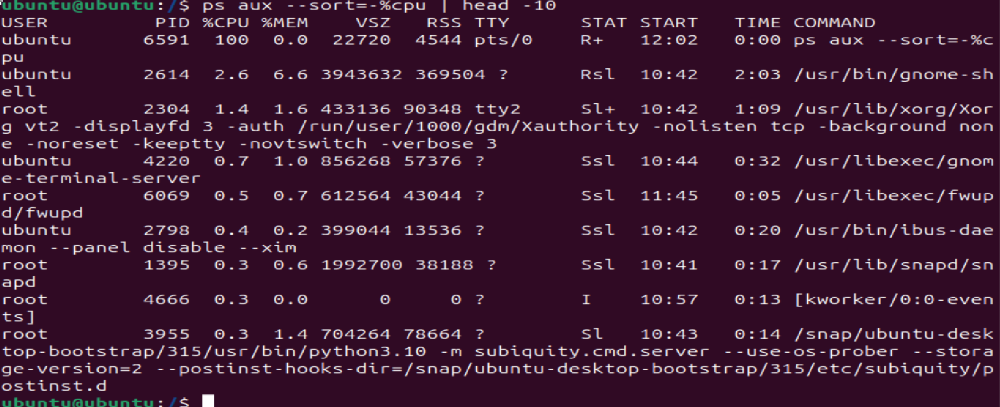
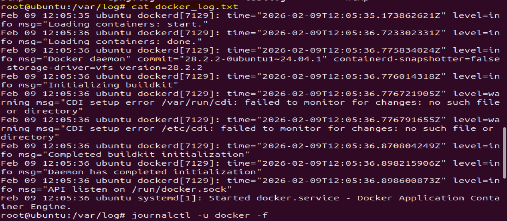
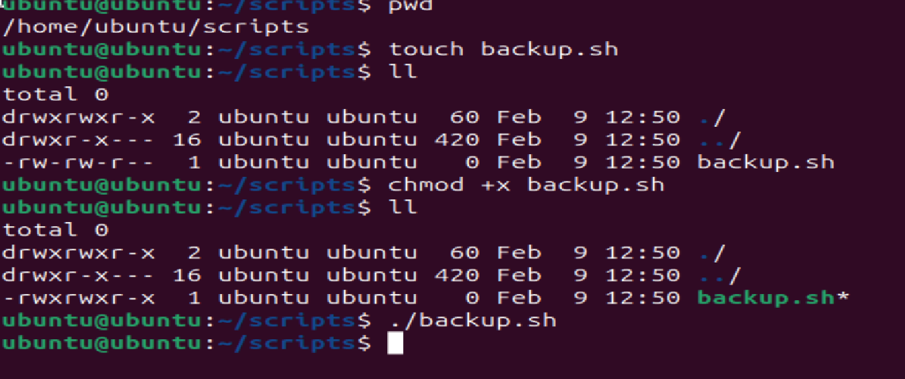

 Day 07 – Linux File System Hierarchy & Scenario-Based Practice

## Task
Today's goal is to **understand where things live in Linux** and **practice troubleshooting like a DevOps engineer**.

### Part 1: Linux File System Hierarchy (30 minutes)

Document the purpose of these **essential** directories:

**Core Directories (Must Know):**
- `/` (root) - The starting point of everything : 

* This is the top-level directory. Every file and directory in Linux starts from here.
* Example content: bin, etc, home
* I would use this when I want to understand the overall system structure.

- `/home` - User home directories

* It is home directory of normal user

* Example content : Documents,Downloads

- `/root` - Root user's home directory

* It is home directory of root/super user
* Example content : bin,sbin,var,etc..

- `/etc` - Configuration files

* Stores system-wide configuration files.
* Example content: hostname, hosts
* I would use this when configuring services or system settings.

- `/var/log` - Log files (very important for DevOps!)

* Contains log files generated by services and the system.
* Example content: syslog, auth.log
* I would use this when troubleshooting errors and service issues.

- `/tmp` - Temporary files

* Stores temporary files created by applications.
* Example content: temporary cache files
* I would use this for short-lived files that don’t need persistence. 

**Additional Directories (Good to Know):**
- `/bin` - Essential command binaries

* Contains essential command binaries needed for basic system operation.
* Example content: ls, cp
* I would use this when running basic Linux commands.

- `/usr/bin` - User command binaries

* Contains user-level command binaries.
* Example content: docker, git
* I would use this when executing installed applications.

- `/opt` - Optional/third-party applications

* Used for optional or third-party software installations.
* Example content: /opt/google, /opt/custom-app
* I would use this when installing external applications.


**Hands-on task:**
```bash
# Find the largest log file in /var/log
du -sh /var/log/* 2>/dev/null | sort -h | tail -5

# Look at a config file in /etc
cat /etc/hostname

# Check your home directory
ls -la ~

```
**My Solution (Step by step):**

**Step 1:** Check service status
```bash
systemctl status nginx
```


**Why this command?** It shows if the service is active, failed, or stopped

**Step 2:** If service is not found, list all services
```bash
systemctl list-units --type=service
```


**Why this command?** To see what services exist on the system

**Step 3:** Check if service is enabled on boot
```bash
systemctl is-enabled nginx


**Scenario 1: Service Not Starting** 
```
A web application service called 'nginx' failed to start after a server reboot.
What commands would you run to diagnose the issue?
Write at least 4 commands in order.

First check: Is the service running or failed?
Then check: What do the logs say?
Finally check: Is it enabled to start on boot?

*
**Step 1:** Check service status
```bash
systemctl status nginx
```


**why?** - To check the status of the service

**Step2:** List all running services 
```bash
systemctl list-units --type=service
```


**why?** - List all running service

**Step3:** Check systemd logs
```bash
journalctl -u nginx -n 50
```


**why?** - To check the logs of service.

**Step4:** 
```bash
systemctl is-enabled nginx
```


**why?** - It show is service is enabled on boot.


---

**Scenario 2: High CPU Usage** 
```
Your manager reports that the application server is slow.
You SSH into the server. What commands would you run to identify
which process is using high CPU?
```
Use a command that shows live CPU usage
Look for processes sorted by CPU percentage
Note the PID (Process ID) of the top process
**Step1:** 
```bash
ps aux --sort=-%cpu | head -5
```


**why?** - list the top CPU-consuming processes in sorted order.

***Scenario 3: Finding Service Logs***
```
A developer asks: "Where are the logs for the 'docker' service?"
The service is managed by systemd.
What commands would you use?
```

**Hint:**
- systemd services → logs are in journald
- Command pattern: `journalctl -u <service-name>`
- Use -n flag to limit number of lines
- Use -f flag to follow logs in real-time (like tail -f)

**Step1** 
```bash
systemctl status docker
```


**why?** - Check the status of the docker

**Step2** 
```bash
journalctl -u docker -f 
```

**why?** - systemd service logs are access using journaclt command.

**Scenario 4: File Permissions Issue** 
```
A script at /home/user/backup.sh is not executing.
When you run it: ./backup.sh
You get: "Permission denied"

What commands would you use to fix this?
```

**Steps**
Step 1: Check current permissions
Command: ls -l /home/user/backup.sh
Look for: -rw-r--r-- (notice no 'x' = not executable)

Step 2: Add execute permission
Command: chmod +x /home/user/backup.sh

Step 3: Verify it worked
Command: ls -l /home/user/backup.sh
Look for: -rwxr-xr-x (notice 'x' = executable)

Step 4: Try running it
Command: ./backup.sh



## Why This Matters for DevOps
Understanding the file system is critical for:
- Knowing where to find logs, configs, and binaries
- Troubleshooting deployment issues
- Writing automation scripts that work across systems

Scenario-based practice prepares you for:
- Real production incidents
- DevOps interviews
- On-call troubleshooting under pressure

These are questions you **will** face in interviews and during real incidents.
