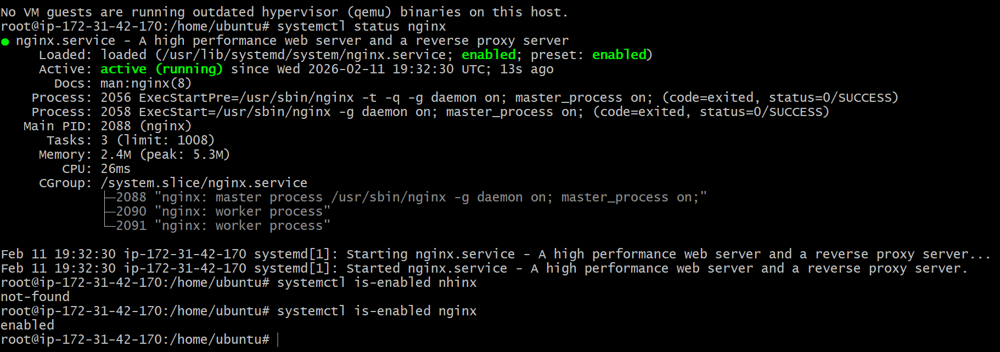
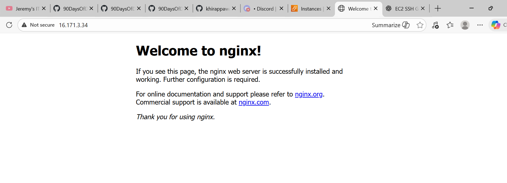
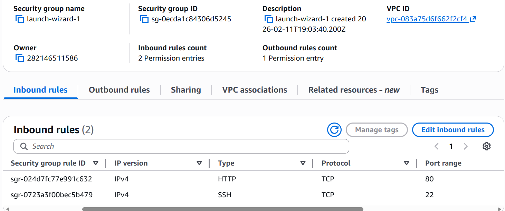
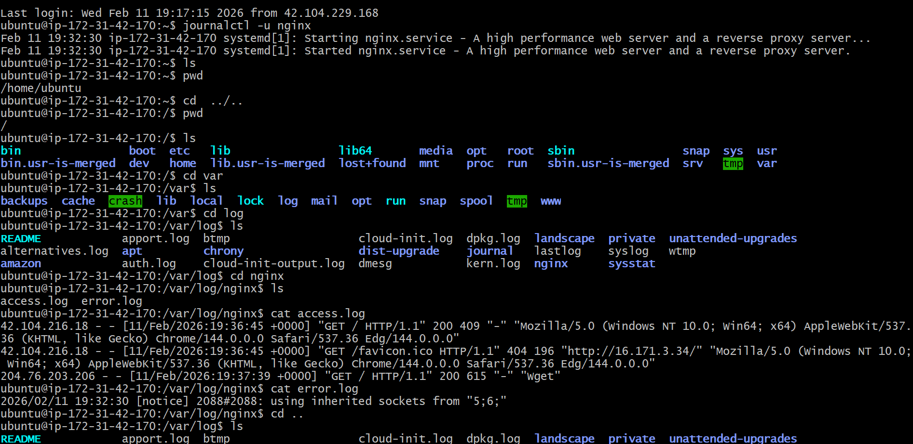
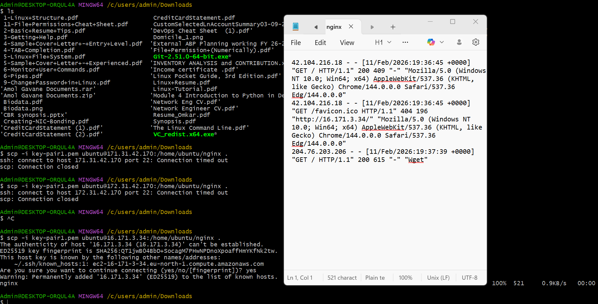

# Day 08 – Cloud Server Setup: Docker, Nginx & Web Deployment

## Task
Today's goal is to **deploy a real web server on the cloud** and learn practical server management.

You will:
- Launch a cloud instance (AWS EC2 or Utho)
- Connect via SSH
- Install Nginx
- Configure security groups for web access (port 80 by default for nginx)
- Extract and save logs to a file
- Verify your webpage is accessible from the internet


art 1: Launch Cloud Instance & SSH Access (15 minutes)

**Step 1: Create a Cloud Instance**


**Step 2: Connect via SSH**


---

### Part 2: Install Docker & Nginx (20 minutes)

**Step 1: Update System**


**Step 3: Install Nginx**

**Verify Nginx is running:**

 

 



---

### Part 3: Security Group Configuration (10 minutes)

**Test Web Access:**
Open browser and visit: `http://<your-instance-ip>`

You should see the **Nginx welcome page**!

📸 **Screenshot this page** - you'll need it for submission

---

### Part 4: Extract Nginx Logs (15 minutes)

**Step 1: View Nginx Logs**

**Step 2: Save Logs to File**

**Step 3: Download Log File to Your Local Machine**
```bash



