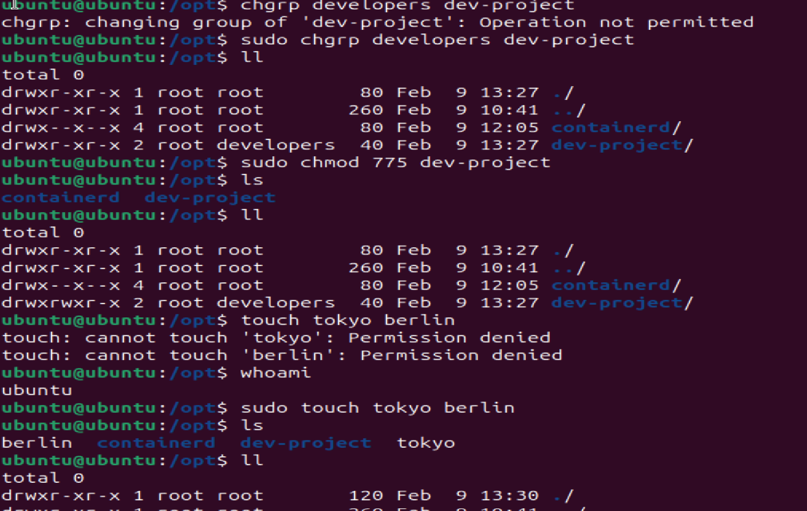
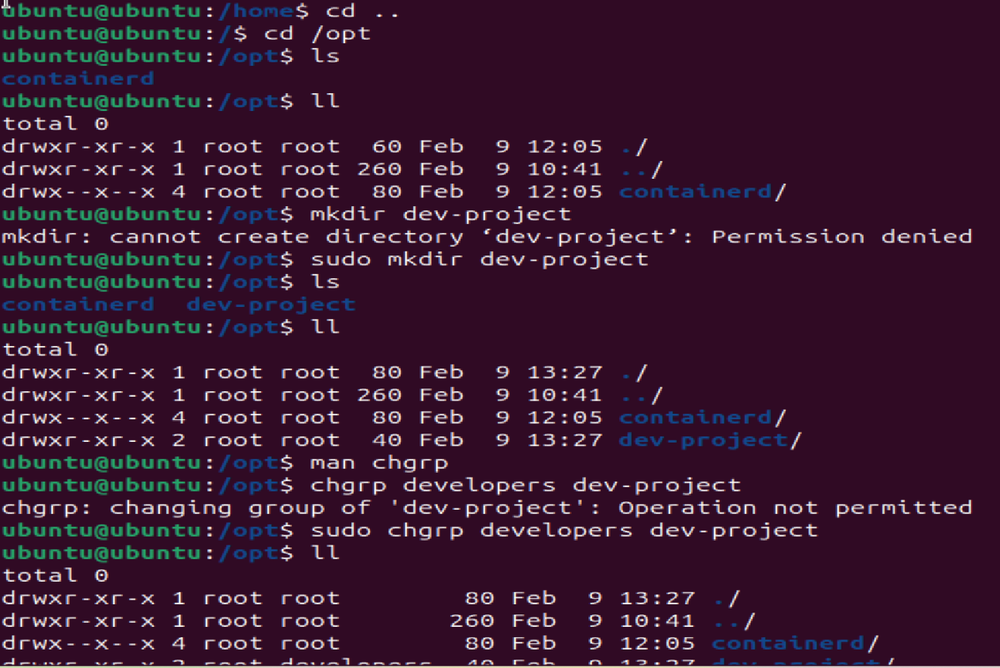
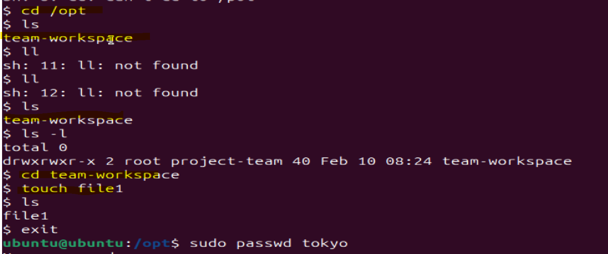
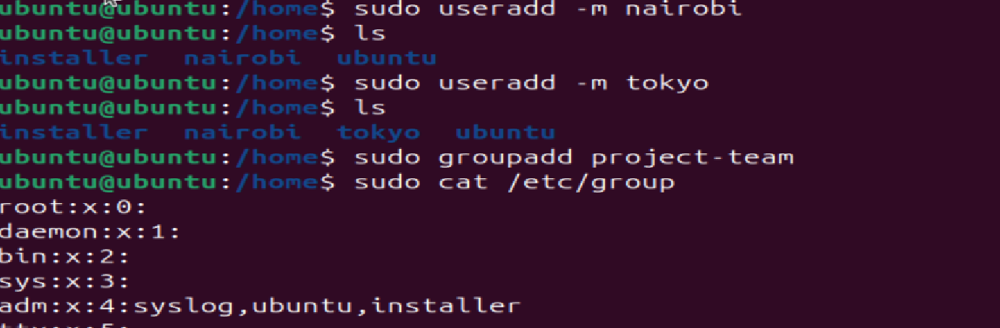
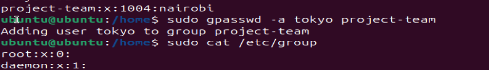
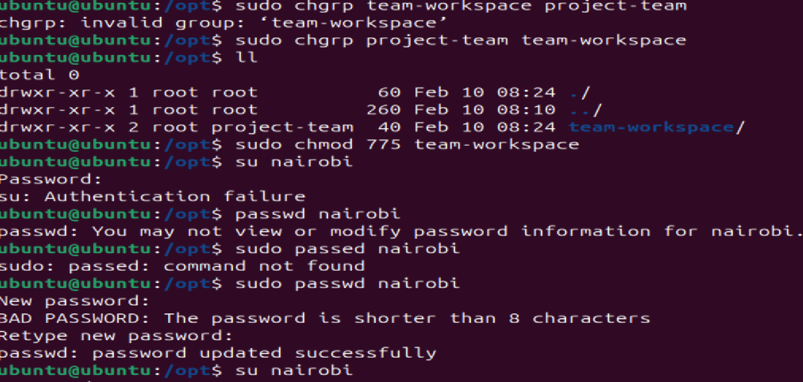

## Day 09 – Linux User & Group Management Challenge ##

**Figure out how to:**

- Create users and set passwords
- Create groups and assign users
- Set up shared directories with group permissions

**Task 1: Create Users**
Create three users with home directories and passwords:
```bash
tokyo
berlin
professor
```


**Task 2: Create Group**
Create two groups:
```bash
developers
admins
Verify: Check /etc/group
```


**Task 3: Assign to Groups**
Assign users:
```bash
tokyo → developers
berlin → developers + admins (both groups)
professor → admins
```


**Task 4: Shared Directory**
Create directory: /opt/dev-project
```bash
Set group owner to developers
Set permissions to 775 (rwxrwxr-x)
Test by creating files as tokyo and berlin
```
 


**Task 5: Team Workspace**
```bash
Create user nairobi with home directory
Create group project-team
Add nairobi and tokyo to project-team
Create /opt/team-workspace directory
Set group to project-team, permissions to 775
Test by creating file as nairobi
```
 
 

 

 **Commands used :-**
 ```bash 
 User: useradd, passwd, usermod
Group: groupadd, groups
Permissions: chgrp, chmod
Test: sudo -u username command
```
