 Day 11 – File Ownership Challenge (chown & chgrp)

## Task
Master file and directory ownership in Linux.

- Understand file ownership (user and group)
- Change file owner using `chown`
- Change file group using `chgrp`
- Apply ownership changes recursively

## Challenge Tasks

### Task 1: Understanding Ownership (10 minutes)

1. Run `ls -l` in your home directory
2. Identify the **owner** and **group** columns
3. Check who owns your files

**Format:** `-rw-r--r-- 1 owner group size date filename`
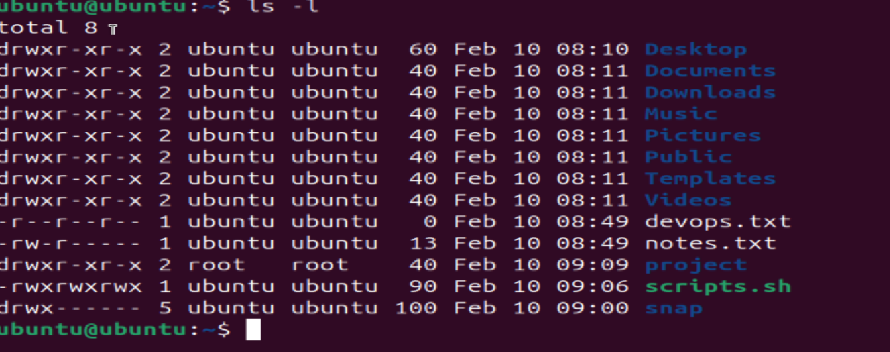

**What's the difference between owner and group?**
 - The user who owns the file or directory. The owner has special privileges, such as the ability to change permissions using chmod or transfer ownership using chown.
 - A collection of users who share access to a file or directory. Permissions for the group can be managed separately from the owner.

 ### Task 2: Basic chown Operations (20 minutes)

1. Create file `devops-file.txt`
2. Check current owner: `ls -l devops-file.txt`
3. Change owner to `tokyo` (create user if needed)
4. Change owner to `berlin`
5. Verify the changes
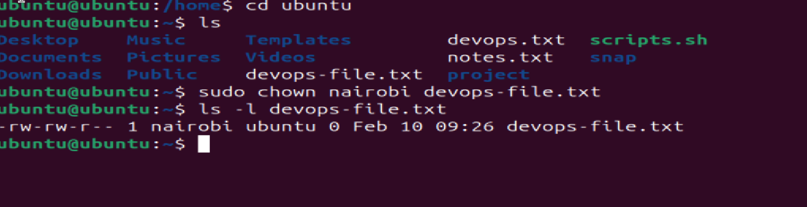

**Try:**
```bash
sudo chown tokyo devops-file.txt
```
### Task 3: Basic chgrp Operations (15 minutes)

1. Create file `team-notes.txt`
2. Check current group: `ls -l team-notes.txt`
3. Create group: `sudo groupadd heist-team`
4. Change file group to `heist-team`
5. Verify the change

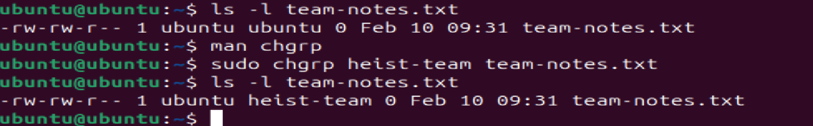

### Task 4: Combined Owner & Group Change (15 minutes)

Using `chown` you can change both owner and group together:

1. Create file `project-config.yaml`
2. Change owner to `professor` AND group to `heist-team` (one command)
3. Create directory `app-logs/`
4. Change its owner to `berlin` and group to `heist-team`

**Syntax:** `sudo chown owner:group filename`

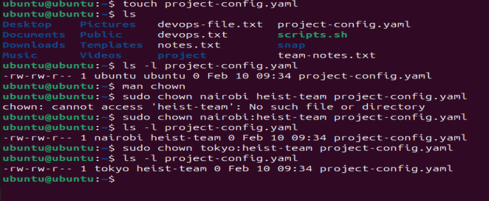


### Task 5: Recursive Ownership (20 minutes)

1. Create directory structure:
   ```
   mkdir -p heist-project/vault
   mkdir -p heist-project/plans
   touch heist-project/vault/gold.txt
   touch heist-project/plans/strategy.conf
   ```

2. Create group `planners`: `sudo groupadd planners`

3. Change ownership of entire `heist-project/` directory:
   - Owner: `professor`
   - Group: `planners`
   - Use recursive flag (`-R`)

4. Verify all files and subdirectories changed: `ls -lR heist-project/`

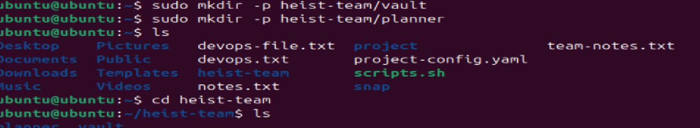
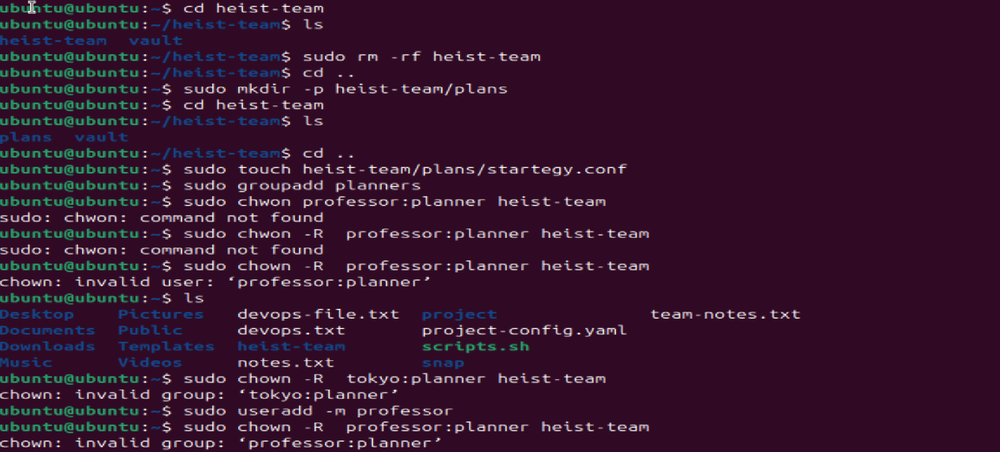
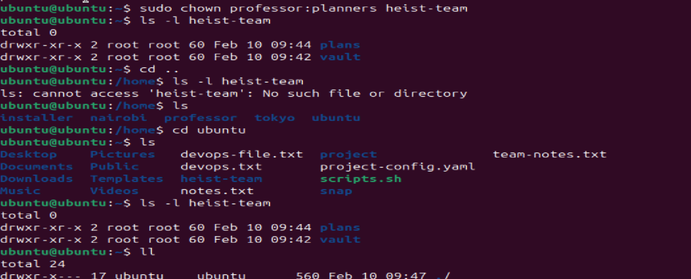
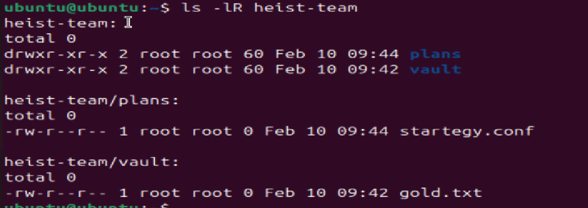

### Task 6: Practice Challenge (20 minutes)

1. Create users: `tokyo`, `berlin`, `nairobi` (if not already created)
2. Create groups: `vault-team`, `tech-team`
3. Create directory: `bank-heist/`
4. Create 3 files inside:
   ```
   touch bank-heist/access-codes.txt
   touch bank-heist/blueprints.pdf
   touch bank-heist/escape-plan.txt
   ```

5. Set different ownership:
   - `access-codes.txt` → owner: `tokyo`, group: `vault-team`
   - `blueprints.pdf` → owner: `berlin`, group: `tech-team`
   - `escape-plan.txt` → owner: `nairobi`, group: `vault-team`

**Verify:** `ls -l bank-heist/`

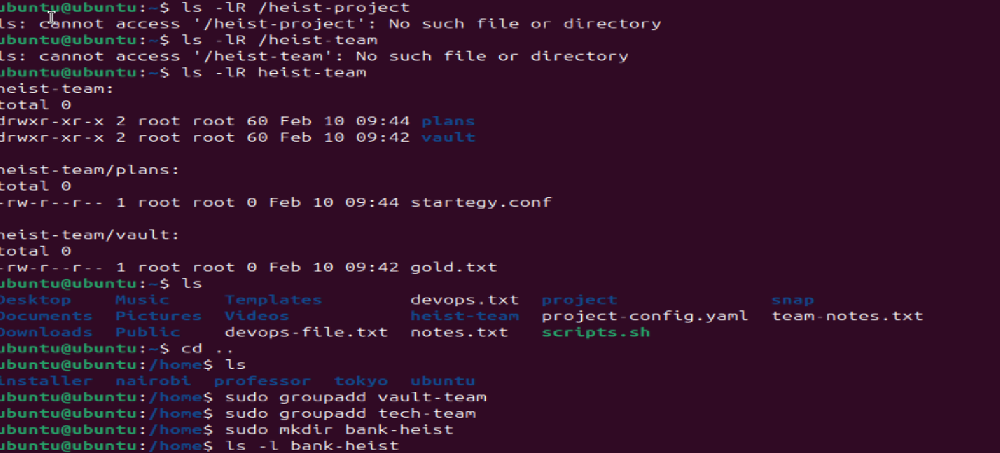
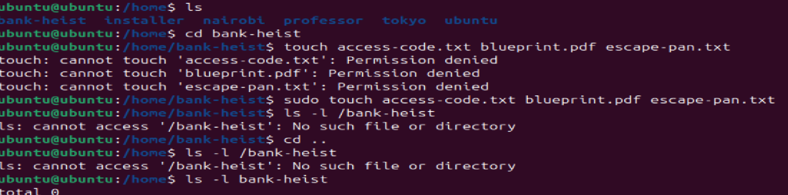
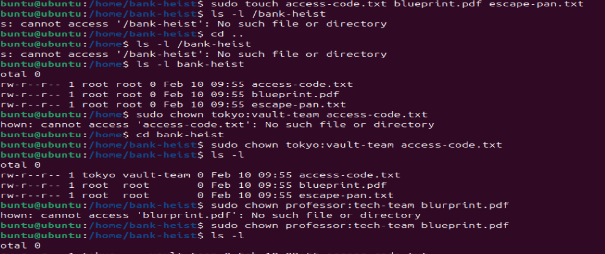
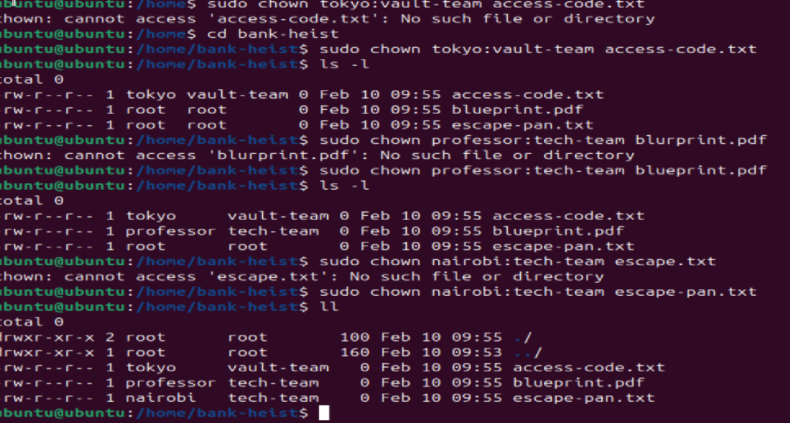


Why This Matters for DevOps
In real DevOps scenarios, you need proper file ownership for:

Application deployments
Shared team directories
Container file permissions
CI/CD pipeline artifacts
Log file management