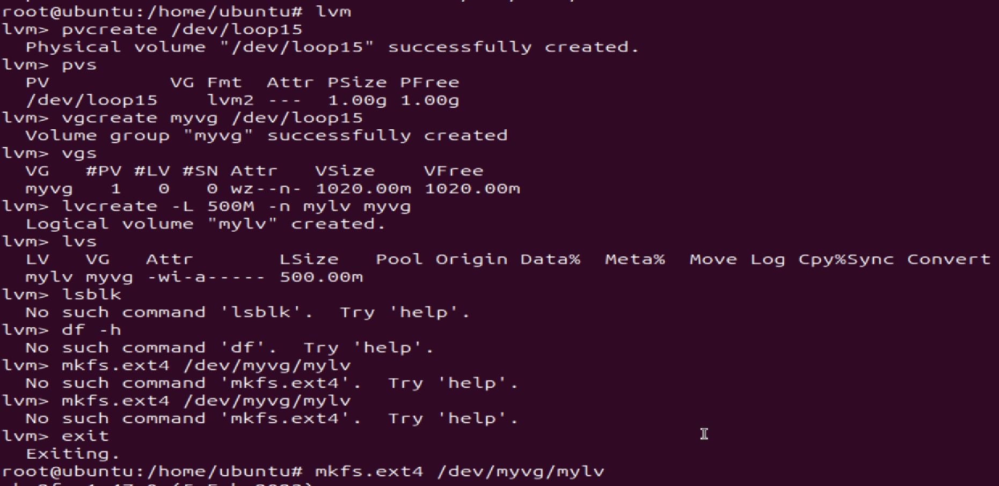
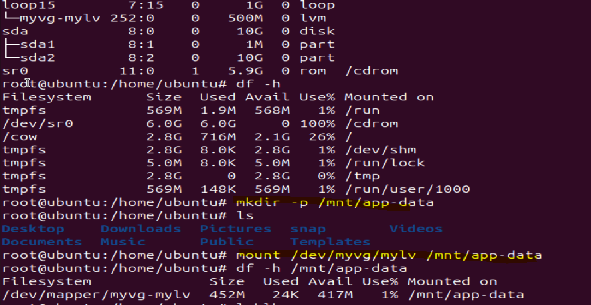
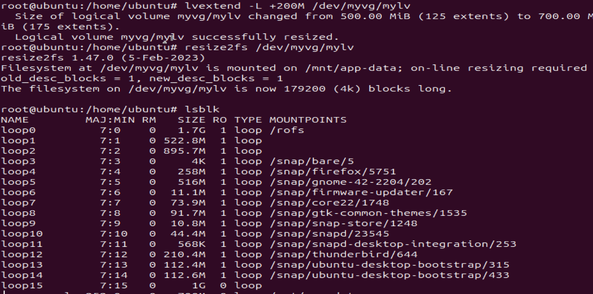

# Day 13 – Linux Volume Management (LVM)

## Task
Learn LVM to manage storage flexibly – create, extend, and mount volumes.

## Challenge Tasks

### Task 1: Check Current Storage
Run: `lsblk`, `pvs`, `vgs`, `lvs`, `df -h`

### Task 2: Create Physical Volume
```bash
pvcreate /dev/loop15  # or your loop device
pvs
```


### Task 3: Create Volume Group
```bash
vgcreate myvg /dev/loop15
vgs
```

### Task 4: Create Logical Volume
```bash
lvcreate -L 500M -n mylv myvg
lvs
```


### Task 5: Format and Mount
```bash
mkfs.ext4 /dev/myvg/mylv
mkdir -p /mnt/app-data
mount /dev/myvg/mylv /mnt/app-data
df -h /mnt/app-data
```


### Task 6: Extend the Volume
```bash
lvextend -L +200M /dev/devops-vg/app-data
resize2fs /dev/devops-vg/app-data
df -h /mnt/app-data
```

