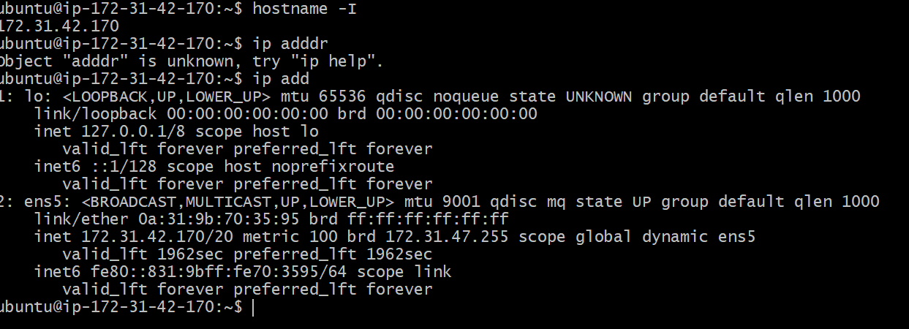
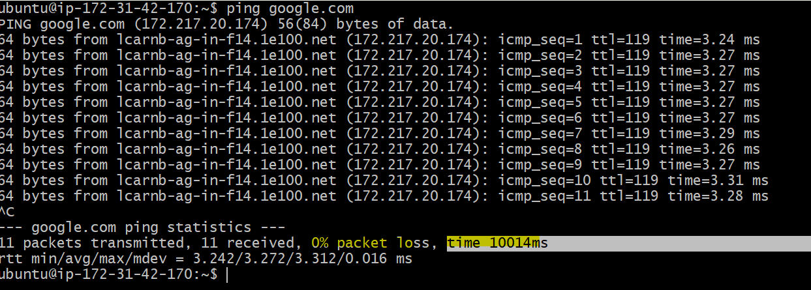
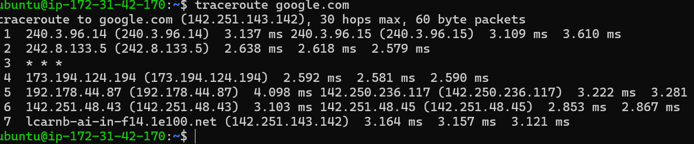
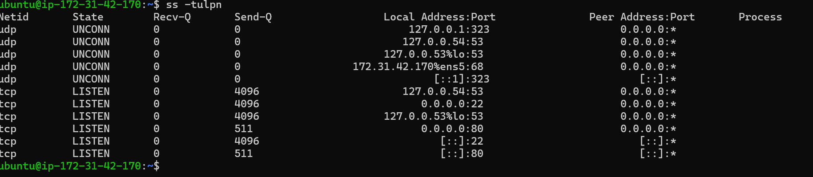
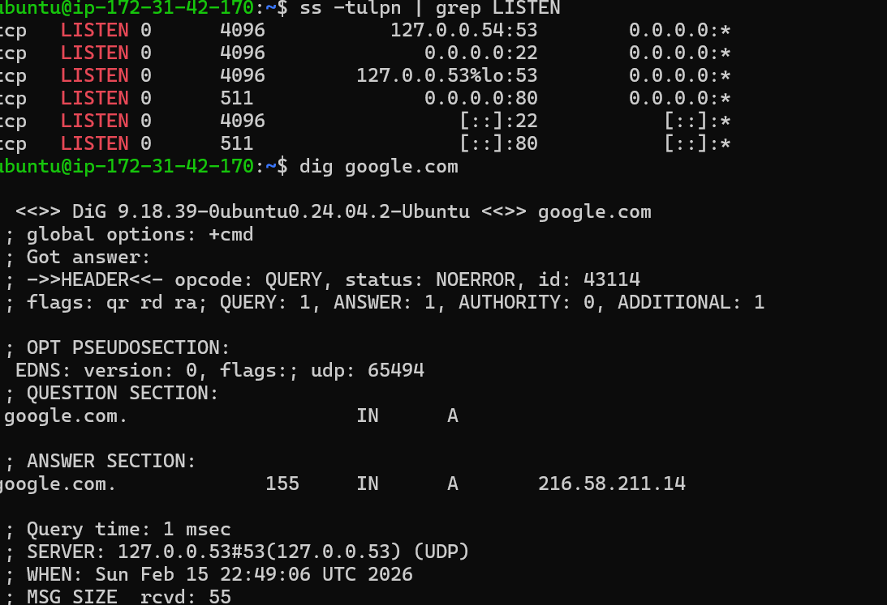
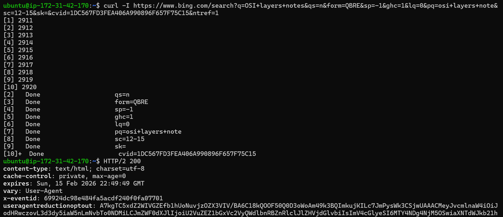
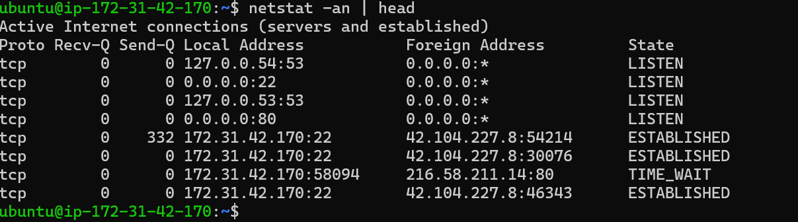

# Day 14 – Networking Fundamentals & Hands-on Checks

## Task
Get comfortable with core networking concepts and the commands you’ll actually run during troubleshooting.

You will:
- Map the **OSI vs TCP/IP models** in your own words
- Run essential connectivity commands
- Capture a mini network check for a target host/service

Keep it short, real, and repeatable.


**OSI Model (Open Systems Interconnection)**

Think of the OSI model as a layered recipe for how computers talk to each other over a network. It has 7 layers, each with its own job:

- **Physical Layer** – Wires, cables, Wi-Fi signals (the actual hardware).
- **Data Link Layer** – Makes sure data moves safely between two devices (like error checking).
- **Network Layer** – Decides the best path for data (IP addresses, routing).
- **Transport Layer** – Ensures data arrives complete and in order (TCP/UDP).
- **Session Layer** – Manages conversations (who’s talking to whom).
- **Presentation Layer** – Translates data into a format apps understand (encryption, compression).
- **Application Layer** – What you see and use (web browsers, email apps).

**👉 Think of it like sending a letter:**
- Physical = the envelope and postman
- Data Link = making sure the address is correct
- Network = choosing the best route
- Transport = ensuring the letter isn’t lost
- Session = keeping track of ongoing conversations
- Presentation = translating languages if needed
- Application = you reading the letter

**TCP/IP Model (Transmission Control Protocol / Internet Protocol)**

This is the real-world version of the OSI model, simpler and actually used on the internet. It has 4 layers:
- Network Interface Layer – Hardware and drivers (like the Physical + Data Link in OSI).
- Internet Layer – IP addresses and routing (like OSI’s Network layer).
- Transport Layer – Ensures reliable delivery (TCP/UDP, same as OSI’s Transport).
- Application Layer – Apps and services (combines OSI’s top three layers).
👉 Think of it like a shortened recipe:
- Network Interface = the envelope and delivery system
- Internet = finding the right address
- Transport = making sure the letter arrives safely
- Application = you reading and replying

**Key Difference**
- OSI = Theoretical, detailed, 7 layers (used for teaching and understanding).
- TCP/IP = Practical, simplified, 4 layers (used in real networking today).

Would you like me to create a visual diagram comparing OSI’s 7 layers with TCP/IP’s 4 layers side by side? That way you’ll see how they map onto each other clearly.

## Hands-on Checklist (run these; add 1–2 line observations)
- **Identity:** `hostname -I` (or `ip addr show`) — note your IP.

```bash
IP= 172.31.42.170 (This is my private IP)
```
- **Reachability:** `ping <target>` — mention latency and packet loss.

**Latency:- 10014 ms
**Packet loss:- 0%

- **Path:** `traceroute <target>` (or `tracepath`) — note any long hops/timeouts.

 **long hops/timeoutsHop 5 - (192.178.44.87)  4.098 ms

- **Ports:** `ss -tulpn` (or `netstat -tulpn`) — list one listening service and its port.

**SSH service listening on port 22.
T**his means remote login is enabled.
- **Name resolution:** `dig <domain>` or `nslookup <domain>` — record the resolved IP.

 **Resolved IP:- 216.58.211.14

- **HTTP check:** `curl -I <http/https-url>` — note the HTTP status code.

**HTTP/2 200
- **Connections snapshot:** `netstat -an | head` — count ESTABLISHED vs LISTEN (rough).

**LISTEN: ~4 ports
**ESTABLISHED: ~3 connections

Pick one target service/host (e.g., `google.com`, your lab server, or a local service) and stick to it for ping/traceroute/curl where possible.


## Reflection (add to your markdown)
- Which command gives you the fastest signal when something is broken?
ping gives the quickest signal to check connectivity.

- What layer (OSI/TCP-IP) would you inspect next if DNS fails? If HTTP 500 shows up?
Check Application layer (DNS service).
Then check network connectivity at Transport/Internet layers.

- Two follow-up checks you’d run in a real incident.
Check service status:

systemctl status nginx
Check logs:

journalctl -u nginx

