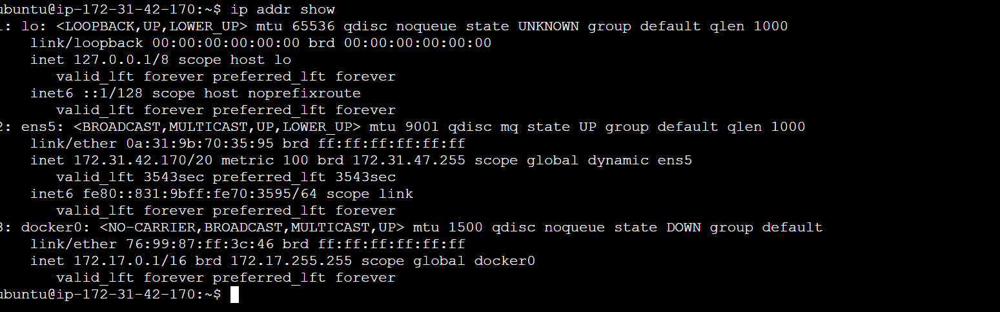
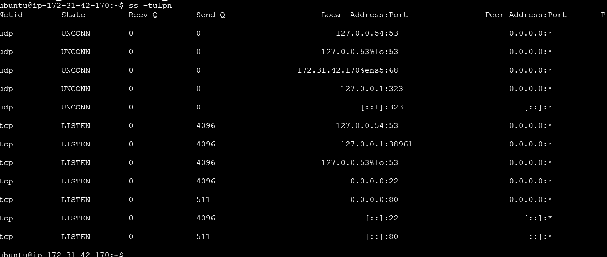

# Day 15 – Networking Concepts: DNS, IP, Subnets & Ports

You will:
- Understand how **DNS** resolves names to IPs
- Learn **IP addressing** (IPv4, public vs private)
- Break down **CIDR notation** and **subnetting** basics
- Know common **ports** and why they matter

1. Explain in 3–4 lines: what happens when you type `google.com` in a browser?
```bash
- When you type google.com in a browser, the browser first sends a request to the DNS server to translate the domain name into an IP address. After receiving the IP address, the browser establishes a TCP connection with the server hosting Google. Then it sends an HTTP/HTTPS request to the server, which responds by sending back the website content that is displayed in your browser.
```
2. What are these record types? Write one line each:
   - `A`, `AAAA`, `CNAME`, `MX`, `NS`
```bash
 A Record – Maps a domain name to an IPv4 address.

AAAA Record – Maps a domain name to an IPv6 address.

CNAME Record – Creates an alias that points one domain name to another domain name.

MX Record – Specifies the mail server responsible for receiving emails for a domain.

NS Record – Defines the authoritative name servers for a domain.
```
3.Run: `dig google.com` — identify the A record and TTL from the output
```bash
When you run:

dig google.com

Look under the ANSWER SECTION. You will see output similar to this:

;; ANSWER SECTION:
google.com.     142     IN     A     142.250.183.206
✅ Identify from this:

A Record (IPv4 address): 142.250.183.206

TTL (Time To Live): 142 seconds

 TTL is the number just before IN, which tells how long (in seconds) the DNS response will be cached.

Note: The IP address and TTL value may change depending on location and time, since Google uses load balancing and multiple servers worldwide.
```
## Task 2: IP Addressing
1. What is an IPv4 address? How is it structured? (e.g., `192.168.1.10`)
```bash
An IPv4 address is a 32-bit logical address used to uniquely identify devices on a network. It is structured into four octets, where each octet is 8 bits, so:

8 × 4 = 32 bits total.

It is written in dotted decimal format, for example: 192.168.1.10, where each octet ranges from 0 to 255. IPv4 addresses were traditionally classified into five classes: Class A, B, C (for general use), D (multicast), and E (reserved/experimental).
```
2. Difference between **public** and **private** IPs — give one example of each
```bash 
Public IP address = Used to identify the devices on the internet and it is assigned by the ISP(Internet Service Provider) and accessible globally.
Private IP = Used within the private network such as home,office network etc.
Not accessible fromm the internet; usually in range like 192.168.0.0 or 10.0.0.0 or 172.16.0.0
```
3. What are the private IP ranges?
   - `10.x.x.x`, `172.16.x.x – 172.31.x.x`, `192.168.x.x`
```bash
he private IPv4 ranges (as defined by RFC 1918) are:

10.0.0.0 – 10.255.255.255 (10.0.0.0/8)

172.16.0.0 – 172.31.255.255 (172.16.0.0/12)

192.168.0.0 – 192.168.255.255 (192.168.0.0/16)

These IP addresses are used inside private networks (like home networks, office networks, AWS VPC, etc.) and are not routable on the public internet.
```
4. Run: `ip addr show` — identify which of your IPs are private
```bash

IP - 172.31.42.170/20
```

Task 3: CIDR & Subnetting
1. What does `/24` mean in `192.168.1.0/24`?
```bash
/24 in 192.168.1.0/24 is called CIDR notation.

It means 24 bits are used for the network portion of the IP address, and the remaining bits are used for hosts.

Since IPv4 has 32 bits total:

Host bits = 32 − 24 = 8

Total IP addresses =

2^8

So, a /24 network has 256 total IP addresses, out of which 254 are usable (excluding network and broadcast addresses).
```
2. How many usable hosts in a `/24`? A `/16`? A `/28`?
```bash
To calculate **usable hosts**, use:

**Usable Hosts = 2^(host bits) − 2**
(We subtract 2 for network and broadcast addresses.)

---

### ✅ `/24`

Host bits = 32 − 24 = 8

2^8 - 2

= **254 usable hosts**

---

### ✅ `/16`

Host bits = 32 − 16 = 16

2^16 - 2

= **65,534 usable hosts**

---

### ✅ `/28`

Host bits = 32 − 28 = 4

2^4 - 2

= **14 usable hosts**

---

### 🎯 Final Answers:

* `/24` → **254 usable hosts**
* `/16` → **65,534 usable hosts**
* `/28` → **14 usable hosts**
```
3. Explain in your own words: why do we subnet?
```bash 
We subnet to divide a large network into smaller, manageable networks.

Subnetting helps us use IP addresses efficiently, instead of wasting thousands of unused addresses. It also improves security and performance by isolating different departments, applications, or environments (like dev, staging, production).
```

4. Quick exercise — fill in:
```bash
Here are the correct answers:

CIDR	Subnet Mask	Total IPs	Usable Hosts
/24	255.255.255.0	256	254
/16	255.255.0.0	65,536	65,534
/28	255.255.255.240	16	14
🔎 Quick Logic:

Total IPs = 2^(32 − CIDR)

Usable Hosts = Total IPs − 2 (network + broadcast)
```
### Task 4: Ports – The Doors to Services
1. What is a port? Why do we need them?
2. Document these common ports:

| Port | Service |
|------|---------|
| 22   | ?       |
| 80   | ?       |
| 443  | ?       |
| 53   | ?       |
| 3306 | ?       |
| 6379 | ?       |
| 27017| ?       |
```bash
1️⃣ What is a port? Why do we need them?

A port is a logical communication endpoint on a computer.
While an IP address identifies the machine, a port identifies the specific service or application running on that machine.

We need ports because one server can run multiple services at the same time (like web server, database, SSH). Ports help the system know which service should receive the incoming request.

Example:

IP = Apartment building address
Port = Apartment number 🚪

2️⃣ Common Ports Documentation
Port	Service
22	SSH (Secure Shell)
80	HTTP
443	HTTPS
53	DNS
3306	MySQL
6379	Redis
27017	MongoDB
🔎 DevOps Tip

As someone practicing server management and cloud (like AWS EC2 + Nginx), you’ll frequently work with:

22 → Remote login to servers

80/443 → Web server traffic (like Nginx)

3306 / 27017 / 6379 → Backend databases

Understanding ports is critical for:
Security Groups (AWS)
Firewall rules
Docker container port mapping
Kubernetes services
```

3. Run `ss -tulpn` — match at least 2 listening ports to their services?


---

### Task 5: Putting It Together
Answer in 2–3 lines each:
- You run `curl http://myapp.com:8080` — what networking concepts from today are involved?
- Your app can't reach a database at `10.0.1.50:3306` — what would you check first?
```bash
You run curl http://myapp.com:8080 — what networking concepts are involved?

This involves DNS resolution (converting myapp.com to an IP address), IP addressing, and TCP communication to port 8080. It also uses the HTTP protocol over a specific port, and routing to reach the correct server.

2️⃣ Your app can't reach a database at 10.0.1.50:3306 — what would you check first?

First, I would check network connectivity (same subnet/VPC, routing, firewall or security group rules). Then verify that the database service is running and listening on port 3306, and confirm that access is allowed from the application’s IP.
```
---


```
#90DaysOfDevOps #DevOpsKaJosh #TrainWithShubham
```

Happy Learning!
**TrainWithShubham**
