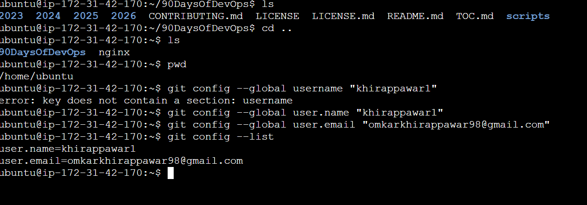
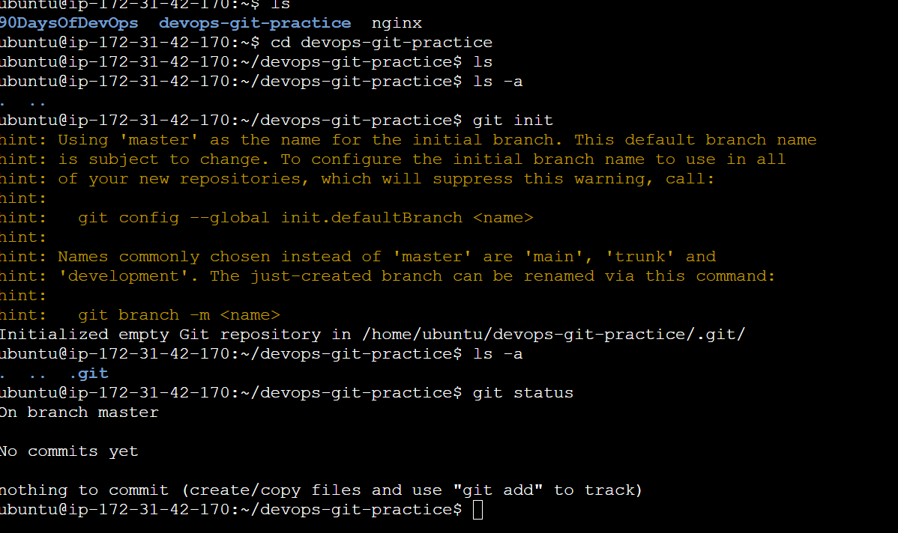
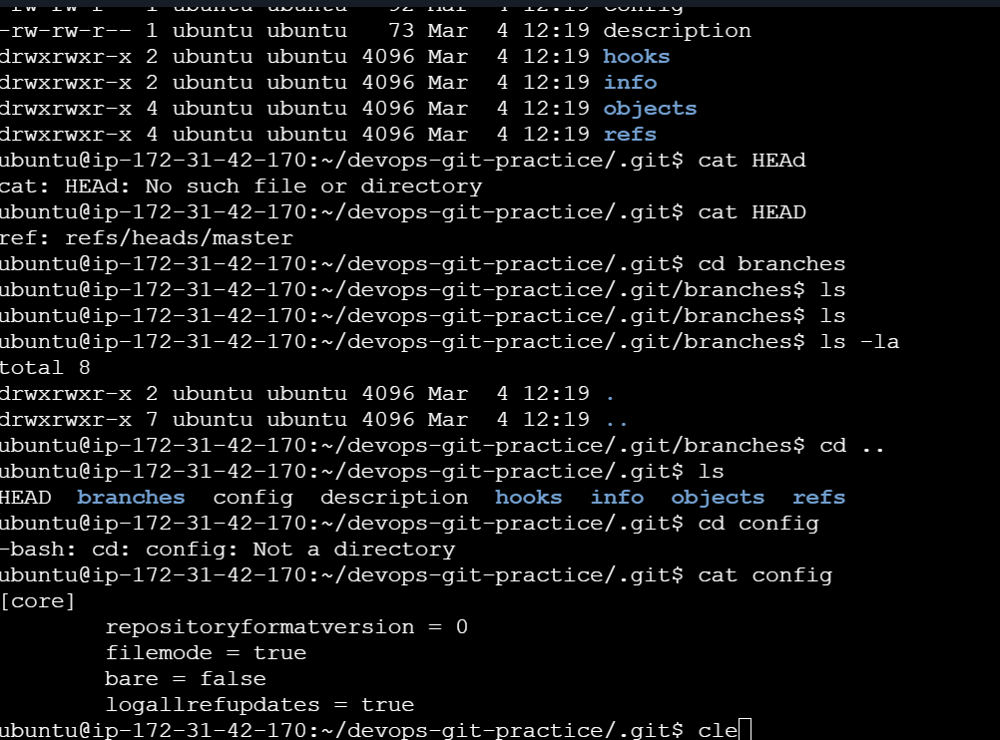

# Day 22 – Introduction to Git: Your First Repository
Today marks the beginning of your Git journey. Git is the backbone of modern DevOps — every tool, pipeline, and workflow revolves around version control. Before diving into advanced concepts, you need to get comfortable with the basics by doing.

You will:
- Understand what Git is and why it matters
- Set up your first Git repository from scratch
- Start building a living document of Git commands

## Challenge Tasks

### Task 1: Install and Configure Git
1. Verify Git is installed on your machine
2. Set up your Git identity — name and email
3. Verify your configuration


4. Why git configuration?
```bash 
Git uses your name and email to label your commits.
If you do not set these, Git will prompt you the first time you try to commit.
```

### Task 2: Create Your Git Project
1. Create a new folder called `devops-git-practice`
2. Initialize it as a Git repository
3. Check the status — read and understand what Git is telling you
4. Explore the hidden `.git/` directory — look at what's inside




### Task 3: Create Your Git Commands Reference
1. Create a file called `git-commands.md` inside the repo
2. Add the Git commands you've used so far, organized by category:
   - **Setup & Config**
   - **Basic Workflow**
   - **Viewing Changes**
3. For each command, write:
   - What it does (1 line)
   - An example of how to use it


### Task 4: Stage and Commit
1. Stage your file
2. Check what's staged
3. Commit with a meaningful message
4. View your commit history
