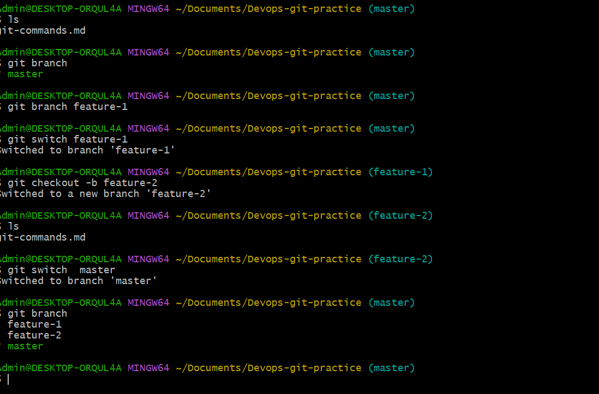
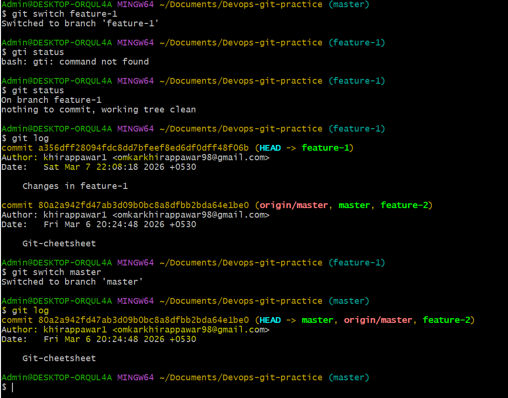

```bash
1.What is a branch in Git?

Ans: A branch in Git is a separate line of development.

Think of it like a parallel workspace where you can work on new features or fixes without affecting the main codebase.

Technically:

A branch is just a pointer to a specific commit.

As you make new commits, the branch pointer moves forward.

Example:

main:    A --- B --- C
                \
feature-x:       D --- E

Here:

main continues stable development

feature-x is where new work happens

2.Why do we use branches instead of committing everything to main?

Ans:Branches help keep the project safe, organized, and collaborative.

Reasons:

1️⃣ Prevent breaking the main code

If you commit everything to main, unfinished work can break the project.
With branches:

main → stable
feature-login → work in progress

2️⃣ Work on multiple features at the same time

Different branches can hold different work.

Example:

main
 ├── feature-login
 ├── feature-payment
 └── bugfix-navbar

3️⃣ Easier collaboration

Multiple developers can work independently.

Example:

Dev A → feature-auth

Dev B → feature-search

Later they merge into main.

4️⃣ Safer experimentation

You can try new ideas without risking the main project.

If it fails → just delete the branch.

3.What is HEAD in Git?

Ans: HEAD is a special pointer that tells Git which commit you are currently working on.

Most of the time:

HEAD → branch → latest commit

4.What happens to your files when you switch branches?


Ans: When switching branches, Git updates the working directory to match the snapshot of the selected branch. Files may change, appear, or disappear based on the branch's commits.
```

### Task 2: Branching Commands — Hands-On
In your `devops-git-practice` repo, perform the following:
1. List all branches in your repo
- Ans: # git branch 
2. Create a new branch called `feature-1`
- Ans: git branch feature-1
3. Switch to `feature-1`
- Ans: git switch feature-1
4. Create a new branch and switch to it in a single command — call it `feature-2`
- Ans: git checkout -b feature-2
5. Try using `git switch` to move between branches — how is it different from `git checkout`?
- Ans: In Git, git switch is used only to switch between branches, making it simpler and safer.
git checkout is an older command that can switch branches, create branches, and restore files, which makes it more powerful but also more confusing.



6. Make a commit on `feature-1` that does **not** exist on `main`
- Ans: # git add . && git commit -m "changes in feature-1" 

7. Switch back to `main` — verify that the commit from `feature-1` is not there
- Ans : # git log (On feature-1)
        # git switch master 
        # git log (On master)



8. Delete a branch you no longer need.
- Ans : # git branch -d feature-2
9. Add all branching commands to your `git-commands.md`

### Task 3: Push to GitHub
1. Create a **new repository** on GitHub (do NOT initialize it with a README)
2. Connect your local `devops-git-practice` repo to the GitHub remote
- Ans: git remote add origin https://github.com/\....devops-git-practice.git
3. Push your `main` branch to GitHub
- Ans : git push -u origin master
4. Push `feature-1` branch to GitHub
- Ans: git push -u origin feature-1
5. Verify both branches are visible on GitHub
- Both branches visible on gitHub. 
6. Answer in your notes: What is the difference between `origin` and `upstream`?
-Ans: origin: the default remote name pointing to the repository.
      upstream: refers to the original repository forked from.

### Task 4: Pull from GitHub
1. Make a change to a file **directly on GitHub** (use the GitHub editor)
2. Pull that change to your local repo
- Ans: # git pull origin master
3. Answer in your notes: What is the difference between `git fetch` and `git pull`?
- Ans: In Git, git fetch downloads the latest changes from the remote repository but does not merge them into your current branch.
git pull downloads the changes and automatically merges them into your current branch.

### Task 5: Clone vs Fork
1. **Clone** any public repository from GitHub to your local machine
- Ans: git clone https://github.com/\... /repo.git
2. **Fork** the same repository on GitHub, then clone your fork
3. Answer in your notes:
   - What is the difference between clone and fork?
    
    Ans: Clone: copies a repository to your local machine.
         Fork: creates your own copy of someone else's repository on GitHub.
   - When would you clone vs fork?
    
     Ans: Clone when you want a local copy of a repo you control.
          Fork when you want to contribute to someone else's project.
   - After forking, how do you keep your fork in sync with the original repo?
    
     Ans: git remote add upstream https://github.com/\.../repo.git
          git fetch upstream
          git merge upstream/main


