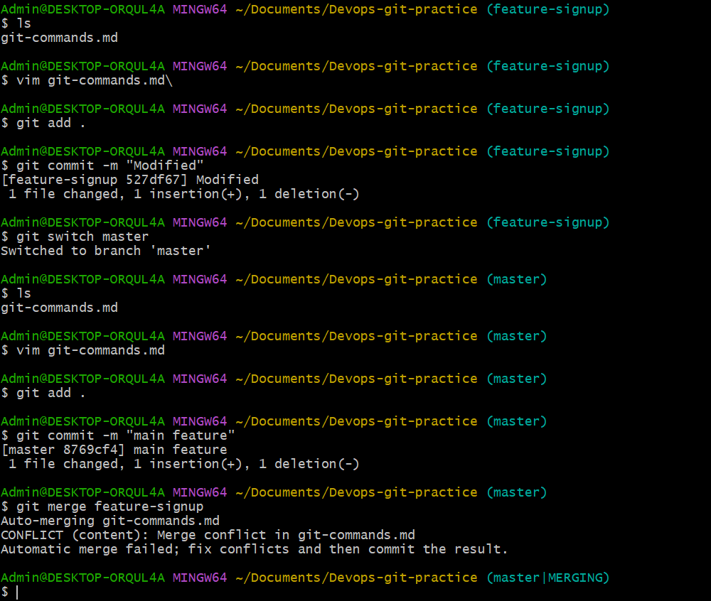
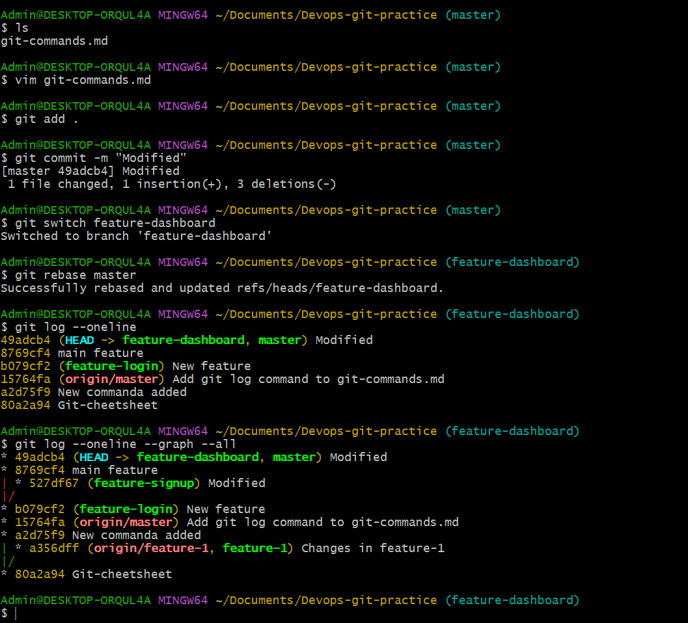
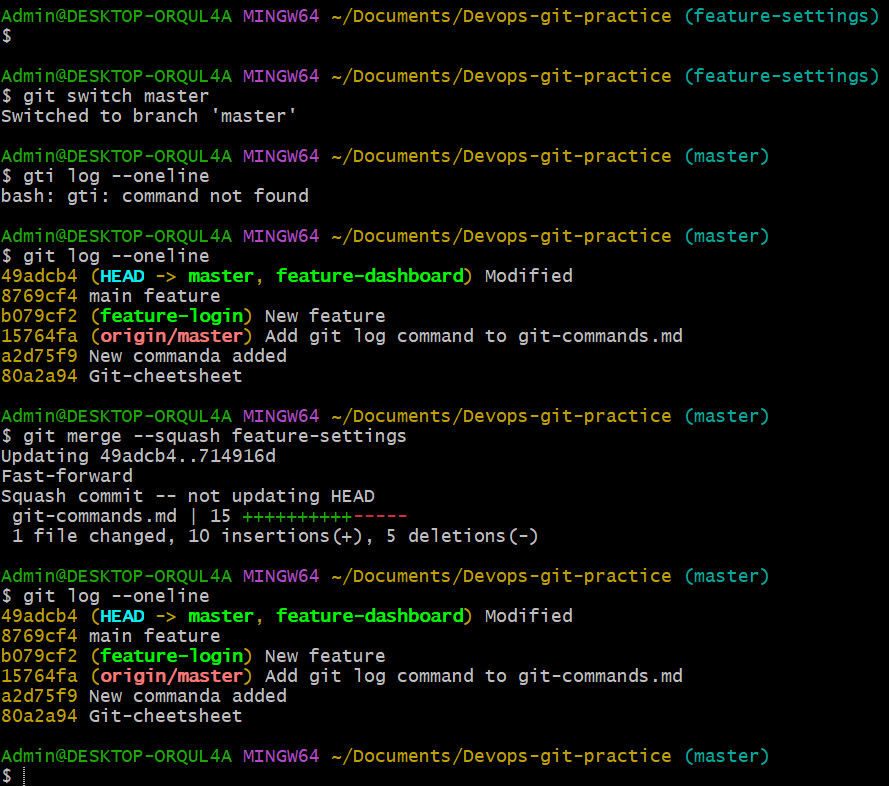
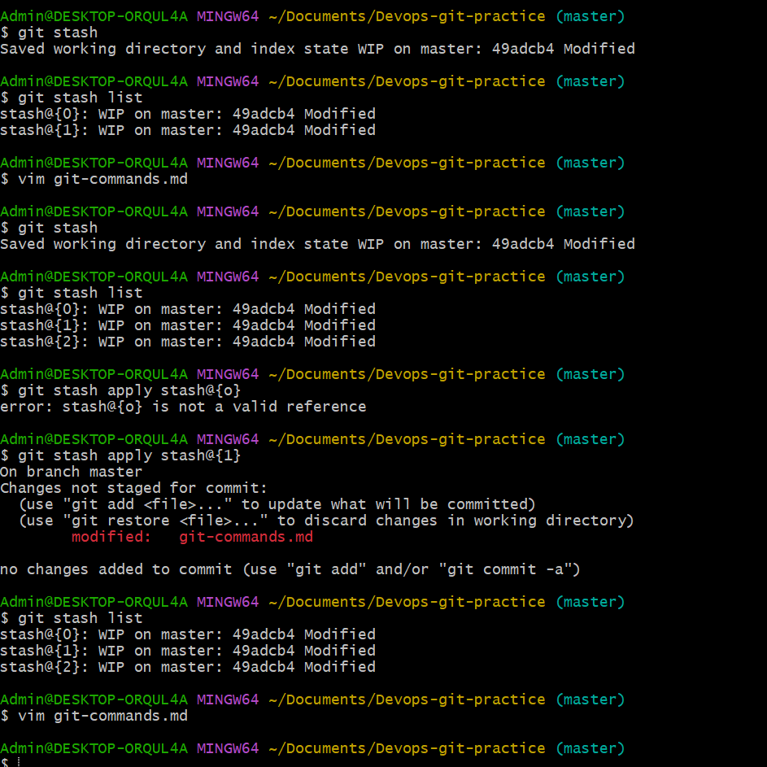
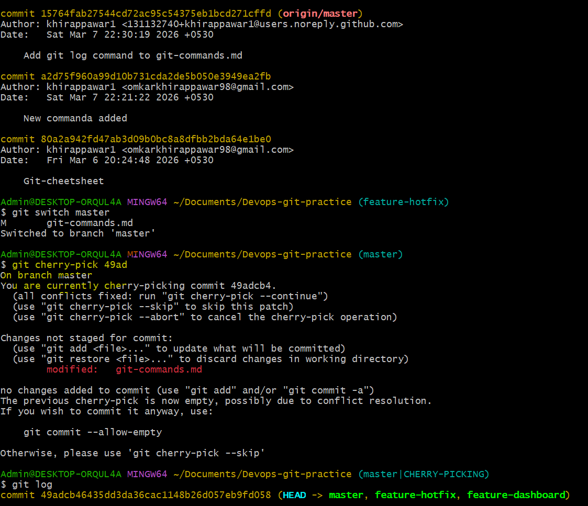

 Day 24 – Advanced Git: Merge, Rebase, Stash & Cherry Pick

## Task

You know how to branch and push to GitHub. Now it's time to learn how branches come back together — and what to do when you're in the middle of something and need to context-switch. These are the Git skills that separate beginners from confident practitioners.

---

## Expected Output
- A markdown file: `day-24-notes.md` with your observations and answers
- Continue updating `git-commands.md` in your `devops-git-practice` repo

---

## Challenge Tasks

### Task 1: Git Merge — Hands-On
1. Create a new branch `feature-login` from `main`, add a couple of commits to it
2. Switch back to `main` and merge `feature-login` into `main`
3. Observe the merge — did Git do a **fast-forward** merge or a **merge commit**?
4. Now create another branch `feature-signup`, add commits to it — but also add a commit to `main` before merging
5. Merge `feature-signup` into `main` — what happens this time?
6. Answer in your notes:
   - What is a fast-forward merge?
      
      Ans: When merging feature-login into master without new commits on master, Git performed a    fast-forward merge.
           A fast-forward merge happens when the main branch has not moved ahead. Git simply moves the branch pointer forward --- no extra merge commit is created.
   - When does Git create a merge commit instead?
    
    Ans: When both branches have diverged, Git combines histories and creates a merge commit to preserve both timelines.
   - What is a merge conflict? (try creating one intentionally by editing the same line in both branches)\

      Ans: A merge conflict occurs when the same line of the same file is modified in both branches.
           Git pauses the merge and asks for manual resolution.

### Task 2: Git Rebase — Hands-On
1. Create a branch `feature-dashboard` from `main`, add 2-3 commits
2. While on `main`, add a new commit (so `main` moves ahead)
3. Switch to `feature-dashboard` and rebase it onto `main`
4. Observe your `git log --oneline --graph --all` — how does the history look compared to a merge?

5. Answer in your notes:
   - What does rebase actually do to your commits?
     
     Ans: In Git, rebase moves your commits to the top of another branch (like main) and reapplies them, creating new commit IDs
   - How is the history different from a merge?

     Ans: Rebase creates a clean, linear history, while a merge keeps a branch history with a merge commit.
   - Why should you **never rebase commits that have been pushed and shared** with others?

     Ans: Because rebase rewrites commit history, which can cause conflicts and confusion for others who already pulled the old commits.
   - When would you use rebase vs merge?

     Ans: Use rebase to keep history clean before merging your work, and use merge when combining shared branches safely.

### Task 3: Squash Commit vs Merge Commit
1. Create a branch `feature-profile`, add 4-5 small commits (typo fix, formatting, etc.)
2. Merge it into `main` using `--squash` — what happens?
3. Check `git log` — how many commits were added to `main`?
4. Now create another branch `feature-settings`, add a few commits
5. Merge it into `main` **without** `--squash` (regular merge) — compare the history

6. Answer in your notes:
   - What does squash merging do?

    Ans: Squash merging combines all commits from a feature branch into a single new commit when merging into the target branch, keeping history cleaner.
   - When would you use squash merge vs regular merge?

   Ans: Use squash merge to create a simplified, linear history when you want to bundle many small or WIP commits into one polished commit before merging.Use regular merge to preserve the full commit history and branch structure, which is useful for detailed tracking and collaboration.
   - What is the trade-off of squashing?

   Ans: Squashing loses individual commit history of the feature branch, making it harder to see step-by-step changes or revert specific commits later.Regular merge keeps all commits but can clutter history with many small commits and merge commits.

   ### Task 4: Git Stash — Hands-On
1. Start making changes to a file but **do not commit**
2. Now imagine you need to urgently switch to another branch — try switching. What happens?
3. Use `git stash` to save your work-in-progress
4. Switch to another branch, do some work, switch back
5. Apply your stashed changes using `git stash pop`
6. Try stashing multiple times and list all stashes
7. Try applying a specific stash from the list

8. Answer in your notes:
   - What is the difference between `git stash pop` and `git stash apply`?
   - When would you use stash in a real-world workflow?
     Ans: Difference between git stash pop and git stash apply:
         git stash pop applies the changes and deletes that stash entry.
        git stash apply applies the changes but keeps the stash for later use.

### Task 5: Cherry Picking
1. Create a branch `feature-hotfix`, make 3 commits with different changes
2. Switch to `main`
3. Cherry-pick **only the second commit** from `feature-hotfix` onto `main`
4. Verify with `git log` that only that one commit was applied

5. Answer in your notes:
   - What does cherry-pick do?

   Ans: git cherry-pick takes a specific commit from one branch and applies that exact change onto your current branch, creating a new commit.
   - When would you use cherry-pick in a real project?

   Ans: To selectively apply bug fixes or features from one branch to another without merging the entire branch.For example, applying a hotfix commit from main to a release branch.
   - What can go wrong with cherry-picking?
   Ans: It can cause conflicts if the code context differs between branches.Creates duplicate commits with different hashes, which can complicate history and cause confusion during later merges or rebases.