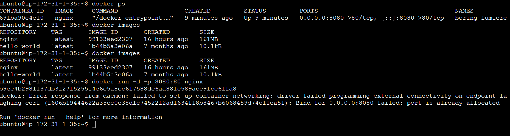
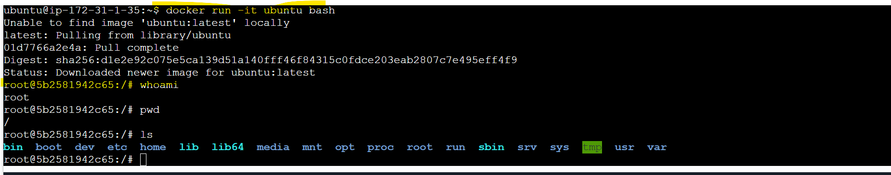
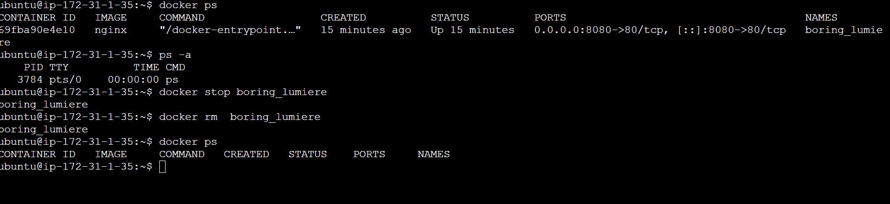

Day 29 – Introduction to Docker

## Task
Today's goal is to **understand what Docker is and run your first container**.y

### Task 1: What is Docker?
Research and write short notes on:
- What is a container and why do we need them?
  Ans: Container is created from image and image can be pulled from the DockerHub or can be created from the Dockerfile. 
  Contrainer holds all the packages that required to run application. 
- Containers vs Virtual Machines — what's the real difference?
  Ans: Each container can share SO but Each VM's has seperate OS.
  Container and light in weight vs VM's are few GB's.
- What is the Docker architecture? (daemon, client, images, containers, registry)\
  Ans: Docker architecture contains Docker Client, Docker Host (Docker Daemon,images,Containers) and DockerHub/Registery.

  ### Task 2: Install Docker
1. Install Docker on your machine (or use a cloud instance)
   Ans: Sudo apt-get update -y -- Updates the base OS
    sudo apt install docker.io -y -- Insatll's the Docker on base OS.
2. Verify the installation
   Ans: docker --version or docker version 
3. Run the `hello-world` container
   Ans: Onec Docker is insatlled in your system, we need to add the current user into Docker group and run newgrp docker command then you only able to run hello-world or further applications.

### Task 3: Run Real Containers
1. Run an **Nginx** container and access it in your browser
  docker run -d -p 8080:80 nginx

2. Run an **Ubuntu** container in interactive mode — explore it like a mini Linux machine
 docker run -it ubuntu bash

3. List all running containers
  docker ps -- list running containers
4. List all containers (including stopped ones)
  docker ps -a -- list all containers
5. Stop and remove a container
   docker stop <container_name>
   docker rm <container_name>

### Task 4: Explore
1. Run a container in **detached mode** — what's different?
  docker run -d nginx 
2. Give a container a custom **name**
  docker -d --name mycontainer nginx
3. Map a **port** from the container to your host
   docker run -d -p 8080:80 nginx
4. Check **logs** of a running container
   docker logs <containername>
5. Run a command **inside** a running container
   docker exec -it <containername> bash