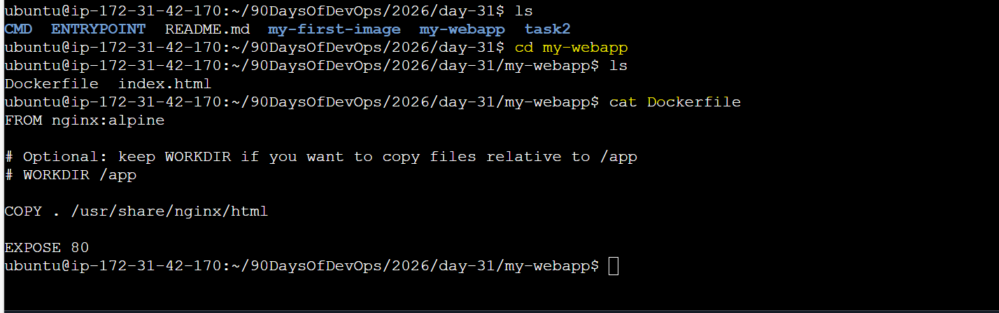
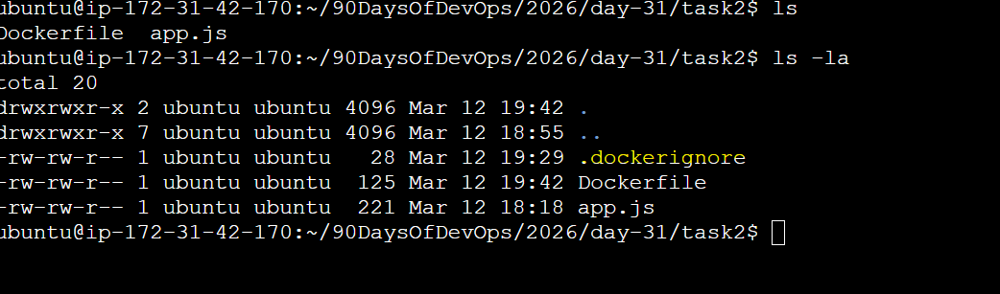

# Day 31 – Dockerfile: Build Your Own Images

## Task
Today's goal is to **write Dockerfiles and build custom images**.

This is the skill that separates someone who uses Docker from someone who actually ships with Docker.

---

## Expected Output
- A markdown file: `day-31-dockerfile.md`
- All Dockerfiles you create

---

## Challenge Tasks

### Task 1: Your First Dockerfile
1. Create a folder called `my-first-image`
2. Inside it, create a `Dockerfile` that:
   - Uses `ubuntu` as the base image
   - Installs `curl`
   - Sets a default command to print `"Hello from my custom image!"`
3. Build the image and tag it `my-ubuntu:v1`
4. Run a container from your image

**Verify:** The message prints on `docker run`

---

### Task 2: Dockerfile Instructions
Create a new Dockerfile that uses **all** of these instructions:
- `FROM` — base image
- `RUN` — execute commands during build
- `COPY` — copy files from host to image
- `WORKDIR` — set working directory
- `EXPOSE` — document the port
- `CMD` — default command

Build and run it. Understand what each line does.

---

### Task 3: CMD vs ENTRYPOINT
1. Create an image with `CMD ["echo", "hello"]` — run it, then run it with a custom command. What happens?
2. Create an image with `ENTRYPOINT ["echo"]` — run it, then run it with additional arguments. What happens?
3. Write in your notes: When would you use CMD vs ENTRYPOINT?

---
```bash
### Task 4: Build a Simple Web App Image
1. Create a small static HTML file (`index.html`) with any content
2. Write a Dockerfile that:
   - Uses `nginx:alpine` as base
   - Copies your `index.html` to the Nginx web directory
3. Build and tag it `my-website:v1`
4. Run it with port mapping and access it in your browser

```
---
```bash
### Task 5: .dockerignore
1. Create a `.dockerignore` file in one of your project folders
2. Add entries for: `node_modules`, `.git`, `*.md`, `.env`
3. Build the image — verify that ignored files are not included

```
---
```bash
### Task 6: Build Optimization
1. Build an image, then change one line and rebuild — notice how Docker uses **cache**
2. Reorder your Dockerfile so that frequently changing lines come **last**
3. Write in your notes: Why does layer order matter for build speed?

Docker Build Optimization Notes
1️⃣ Initial Dockerfile
FROM node:18
WORKDIR /app
COPY package.json .
RUN npm install
COPY . .
EXPOSE 3000
CMD ["node", "app.js"]
2️⃣ Build Image
docker build -t my-node-app:v1 .

Docker builds layer by layer

Layers that haven’t changed can reuse cache → faster builds

3️⃣ Change One Line

Edit app.js (change a log or text)

docker build -t my-node-app:v1 .

Docker rebuilds only the layers after the change

Previous layers are “Using cache”

4️⃣ Layer Order Optimization

Frequently changing lines last (app code)

Rarely changing lines first (dependencies, package.json)

COPY package.json .
RUN npm install
COPY . .          # app code (changes often)

✅ Benefit: npm install is cached, rebuilds faster

5️⃣ Why Layer Order Matters

Docker caches per layer

Changing a layer invalidates all layers after it

Proper order = faster incremental builds ⏱️

6️⃣ Verify Cache Usage
docker build -t my-node-app:v1 . --progress=plain

Look for Using cache in build output


```
---

## Hints
- Build: `docker build -t name:tag .`
- The `.` at the end is the build context
- `COPY . .` copies everything from host to container
- Nginx serves files from `/usr/share/nginx/html/`

---

## Submission
1. Add your Dockerfiles and `day-31-dockerfile.md` to `2026/day-31/`
2. Commit and push to your fork

---

## Learn in Public
Share your custom Docker image or Nginx screenshot on LinkedIn.

`#90DaysOfDevOps` `#DevOpsKaJosh` `#TrainWithShubham`

Happy Learning!
**TrainWithShubham**
