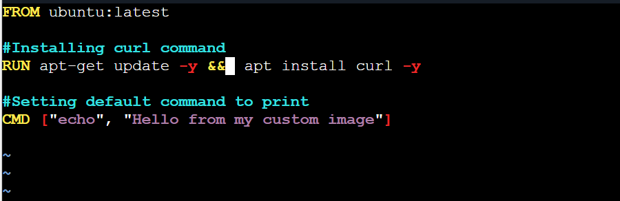

# Day 31 – Dockerfile: Build Your Own Images

## Task
Today's goal is to **write Dockerfiles and build custom images**.

```bash
### Task 1: Your First Dockerfile
1. Create a folder called `my-first-image`

Ans: 
2. Inside it, create a `Dockerfile` that:
   - Uses `ubuntu` as the base image
   - Installs `curl`
   - Sets a default command to print `"Hello from my custom image!"`
3. Build the image and tag it `my-ubuntu:v1`



Ans: docker build -t my-ubuntu:v1

4. Run a container from your image

Ans:: docker run my-ubuntu:v1 
      docker run -it my-ubuntu:v1 bash -- runs in interactive mode   

```

### Task 2: Dockerfile Instructions
Create a new Dockerfile that uses **all** of these instructions:
- `FROM` — base image
- `RUN` — execute commands during build
- `COPY` — copy files from host to image
- `WORKDIR` — set working directory
- `EXPOSE` — document the port
- `CMD` — default command

