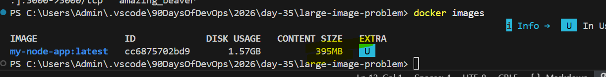
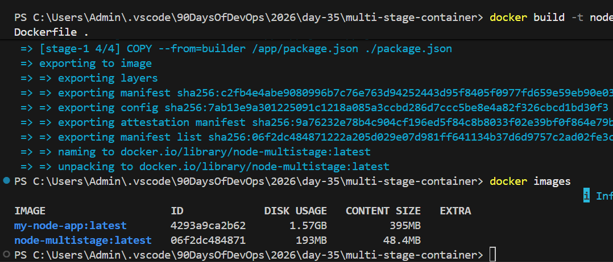
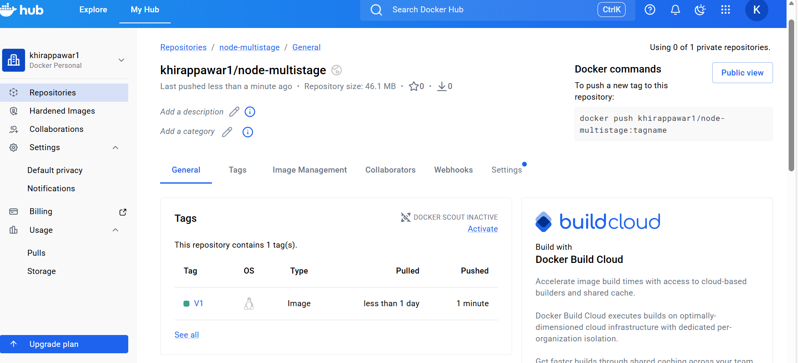

## Task
Today's goal is to **build optimized images and share them with the world**.

Multi-stage builds are how real teams ship small, secure images. Docker Hub is how you distribute them. Both are interview favourites.
```bash 
# Challenge Tasks

### Task 1: The Problem with Large Images
1. Write a simple Go, Java, or Node.js app (even a "Hello World" is fine)
2. Create a Dockerfile that builds and runs it in a **single stage**
3. Build the image and check its **size**

Note down the size — you'll compare it later. 

Ans: Done
```

```bash
### Task 2: Multi-Stage Build
1. Rewrite the Dockerfile using **multi-stage build**:
   - Stage 1: Build the app (install dependencies, compile)
   - Stage 2: Copy only the built artifact into a minimal base image (`alpine`, `distroless`, or `scratch`)
2. Build the image and check its size again
3. Compare the two sizes

Write in your notes: Why is the multi-stage image so much smaller
ns: Done

Write in your notes: Why is the multi-stage image so much smaller?



Ans: By using the multi-satge container the image size is redcued (optimized)
```
```bash 
### Task 3: Push to Docker Hub
1. Create a free account on [Docker Hub](https://hub.docker.com) (if you don't have one)
2. Log in from your terminal

Ans: docker login 

3. Tag your image properly: `yourusername/image-name:tag`

Ans: docker tag node-multistage khirappawar1/nod-multistage:v1

4. Push it to Docker Hub

Ans: docker push khirappawar1/node-multistage:latest 

5. Pull it on a different machine (or after removing locally) to verify

Ans: docker pull khirappawar1/node-multistage:latest
    docker run -d -p 3000:3000 Khirappawar1/node-multistage:latest

```
```bash
### Task 5: Image Best Practices
Apply these to one of your images and rebuild:
1. Use a **minimal base image** (alpine vs ubuntu — compare sizes)
2. **Don't run as root** — add a non-root USER in your Dockerfile
3. Combine `RUN` commands to **reduce layers**
4. Use **specific tags** for base images (not `latest`)


Ans: 1. Use a minimal base image

We’ll use node:20-alpine instead of node:20 or ubuntu.
Alpine is tiny (~60MB) vs Ubuntu (~200-300MB for Node images).

2. Don’t run as root

Add a non-root user and run the app as that user.

3. Combine RUN commands

Instead of multiple RUN statements, combine them to reduce image layers.

4. Use specific tags

Avoid latest—we’ll use node:20.5.1-alpine (example).
```