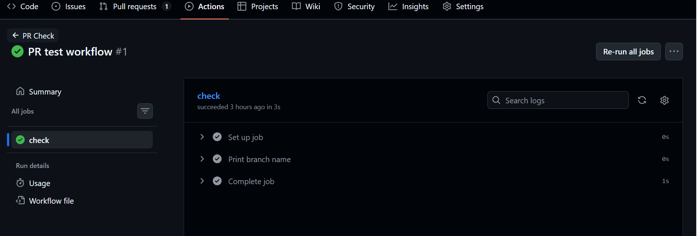
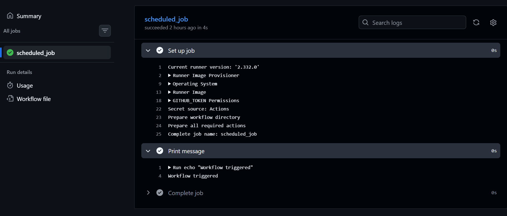
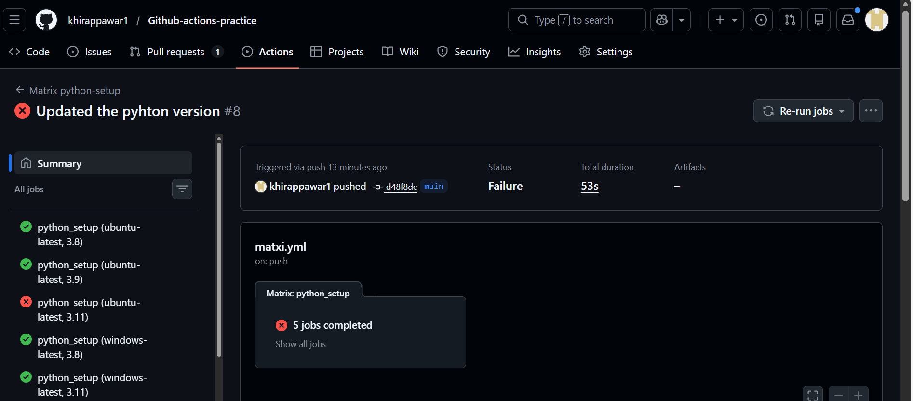

 Day 41 – Triggers & Matrix Builds

## Task
Your pipeline runs on push. Today you learn **every way to trigger a workflow** and how to run jobs across multiple environments at once.

## Challenge Tasks

### Task 1: Trigger on Pull Request
1. Create `.github/workflows/pr-check.yml`
2. Trigger it only when a pull request is **opened or updated** against `main`
3. Add a step that prints: `PR check running for branch: <branch name>`
4. Create a new branch, push a commit, and open a PR
5. Watch the workflow run automatically

https://github.com/khirappawar1/Github-actions-practice/blob/main/.github/workflows/hello.yml

**Verify:** Does it show up on the PR page? - Yes

### Task 2: Scheduled Trigger
1. Add a `schedule:` trigger to any workflow using cron syntax
2. Set it to run every day at midnight UTC
3. Write in your notes: What is the cron expression for every Monday at 9 AM?

https://github.com/khirappawar1/Github-actions-practice/blob/main/.github/workflows/schedule-job.yaml

## Task 3: Manual Trigger
1. Create `.github/workflows/manual.yml` with a `workflow_dispatch:` trigger
2. Add an **input** that asks for an `environment` name (staging/production)
3. Print the input value in a step
4. Go to the **Actions** tab → find the workflow → click **Run workflow**

https://github.com/khirappawar1/Github-actions-practice/blob/main/.github/workflows/manual.yml 

**Verify:** Can you trigger it manually and see your input printed?

### Task 4: Matrix Builds
Create `.github/workflows/matrix.yml` that:
1. Uses a matrix strategy to run the same job across:
   - Python versions: `3.10`, `3.11`, `3.12`
2. Each job installs Python and prints the version
3. Watch all 3 run in parallel

Then extend the matrix to also include 2 operating systems — how many total jobs run now?

---

### Task 5: Exclude & Fail-Fast
1. In your matrix, **exclude** one specific combination (e.g., Python 3.10 on Windows)
2. Set `fail-fast: false` — trigger a failure in one job and observe what happens to the rest
3. Write in your notes: What does `fail-fast: true` (the default) do vs `false`?

Ans: fail-fast: true =	First failing matrix job stops all remaining jobs immediately.
fail-fast: false =	Each matrix job runs independently; failures in one don’t stop others.

https://github.com/khirappawar1/Github-actions-practice/blob/main/.github/workflows/matxi.yml

## Hints
- PR trigger: `on: pull_request: branches: [main]`
- Cron trigger: `on: schedule: - cron: '0 0 * * *'`
- Manual trigger: `on: workflow_dispatch: inputs:`
- Matrix: `strategy: matrix: python-version: [...]`
- Exclude: `exclude: - os: windows-latest python-version: "3.10"`

---