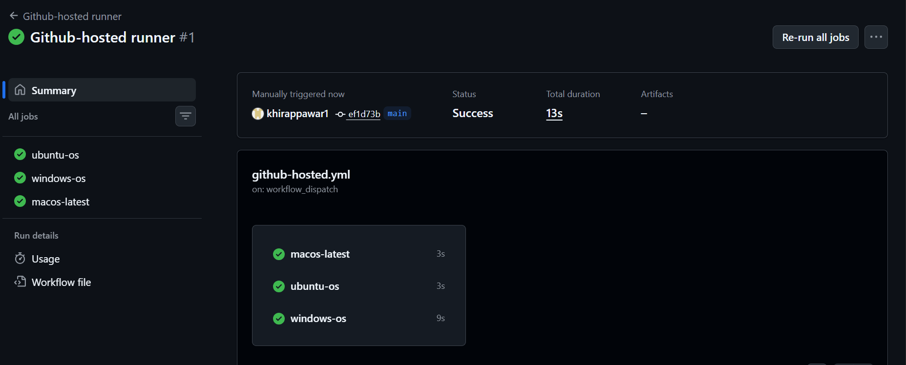
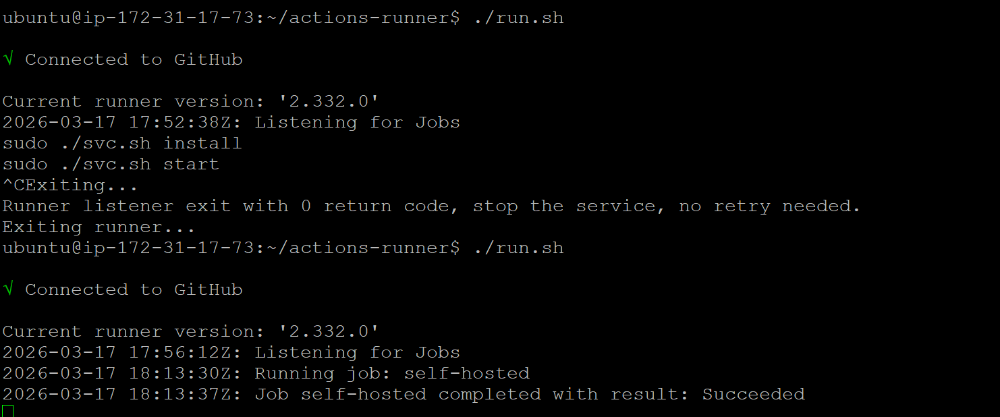
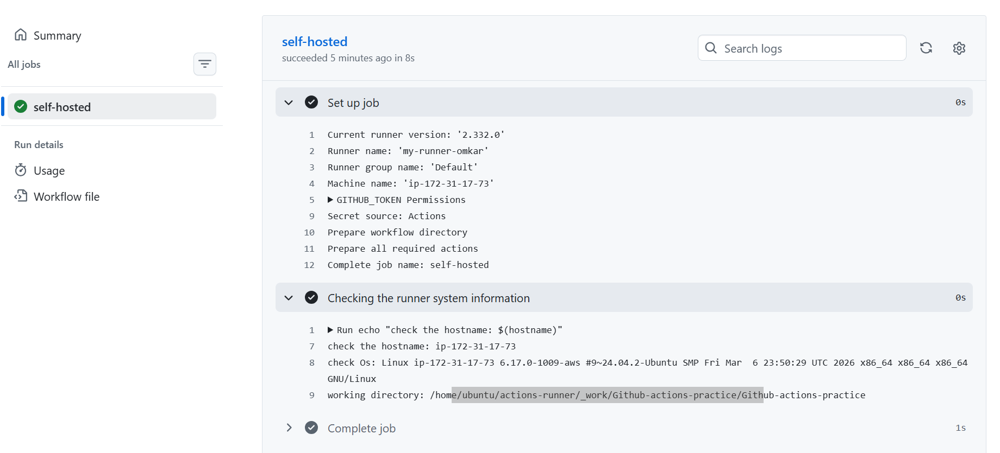
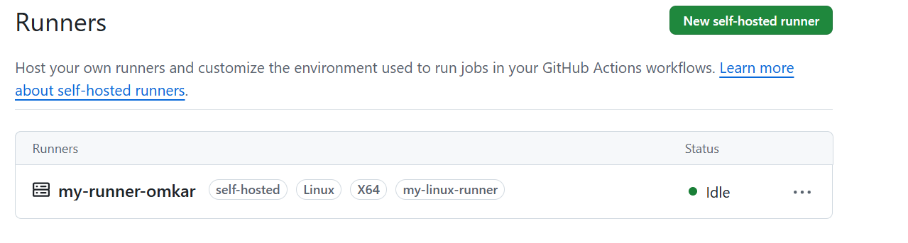

# Day 42 – Runners: GitHub-Hosted & Self-Hosted

## Task
Every job needs a machine to run on. Today you understand **runners** — GitHub's hosted ones and how to set up your own self-hosted runner on a real server.

## Challenge Tasks

### Task 1: GitHub-Hosted Runners
1. Create a workflow with 3 jobs, each on a different OS:
   - `ubuntu-latest`
   - `windows-latest`
   - `macos-latest`
2. In each job, print:
   - The OS name
   - The runner's hostname
   - The current user running the job
3. Watch all 3 run in parallel

Write in your notes: What is a GitHub-hosted runner? Who manages it?

Ans: A GitHub-hosted runner is a virtual machine provided and managed by GitHub that runs your workflow jobs. Each time a workflow runs, GitHub creates a fresh runner, executes the jobs, and then automatically destroys the runner after completion. Users do not need to manage the hardware or the operating system.

https://github.com/khirappawar1/Github-actions-practice/actions/workflows/github-hosted.yml

### Task 2: Explore What's Pre-installed
1. On the `ubuntu-latest` runner, run a step that prints:
   - Docker version
   - Python version
   - Node version
   - Git version
2. Look up the GitHub docs for the full list of pre-installed software on `ubuntu-latest`

Write in your notes: Why does it matter that runners come with tools pre-installed?

Ans: Pre-installed software are updated and maintained by the Github on weekly basics. Pre-insatlled software save the setup time, allowing workflows to start immediately without installing the dependecies. This makes the less configuration error's and build faster, reliable and consistent. 

### Task 3: Set Up a Self-Hosted Runner
1. Go to your GitHub repo → Settings → Actions → Runners → **New self-hosted runner**
2. Choose Linux as the OS
3. Follow the instructions to download and configure the runner on:
   - Your local machine, OR
   - A cloud VM (EC2, Utho, or any VPS)
4. Start the runner — verify it shows as **Idle** in GitHub

**Verify:** Your runner appears in the Runners list with a green dot? - Yes. 

https://github.com/khirappawar1/Github-actions-practice/actions/workflows/self-hosted.yml

