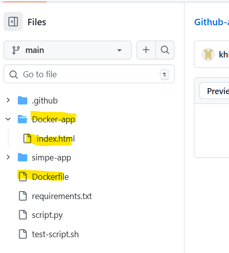

# Day 45 – Docker Build & Push in GitHub Actions

Today you build a **complete CI/CD pipeline** — code pushed to GitHub automatically builds a Docker image and ships it to Docker Hub. No manual steps.

### Task 2: Build the Docker Image in CI
Create `.github/workflows/docker-publish.yml` that:
1. Triggers on push to `main`
2. Checks out the code
3. Builds the Docker image and tags it

**Verify:** Check the build step logs — does the image build successfully?

https://github.com/khirappawar1/Github-actions-practice/blob/main/.github/workflows/Docker-publish.yml

### Task 3: Push to Docker Hub
Add steps to:
1. Log in to Docker Hub using your secrets
2. Tag the image as `username/repo:latest` and also `username/repo:sha-<short-commit-hash>`
3. Push both tags

**Verify:** Go to Docker Hub — is your image there with both tags? - Yes

Task 4: Only Push on Main
Add a condition so the push step only runs on the `main` branch — not on feature branches or PRs.

Test it: push to a feature branch and verify the image is built but NOT pushed. - Done

### Task 5: Add a Status Badge
1. Get the badge URL for your `docker-publish` workflow from the Actions tab
2. Add it to your `README.md`
3. Push — the badge should show green

Done

### Task 6: Pull and Run It
1. On your local machine (or a cloud server), pull the image you just pushed
2. Run it
3. Confirm it works

Write in your notes: What is the full journey from `git push` to a running container?

Ans: Able to push to dockerhub using the CICD and after that pulled from the Repo and started the container. 

 - Project directory

## Hints
- Docker login: `uses: docker/login-action@v3`
- Build and push: `uses: docker/build-push-action@v5`
- Short SHA: `${{ github.sha }}` (use `cut` or `slice` to get first 7 chars)
- Badge URL format: `https://github.com/<user>/<repo>/actions/workflows/<file>.yml/badge.svg`