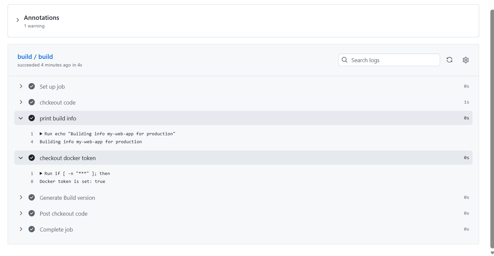
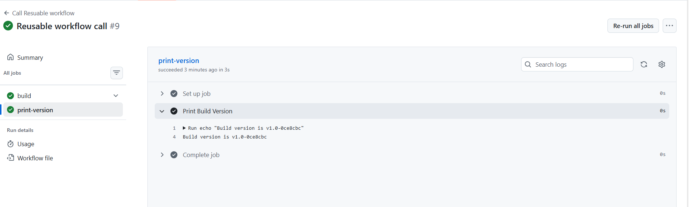
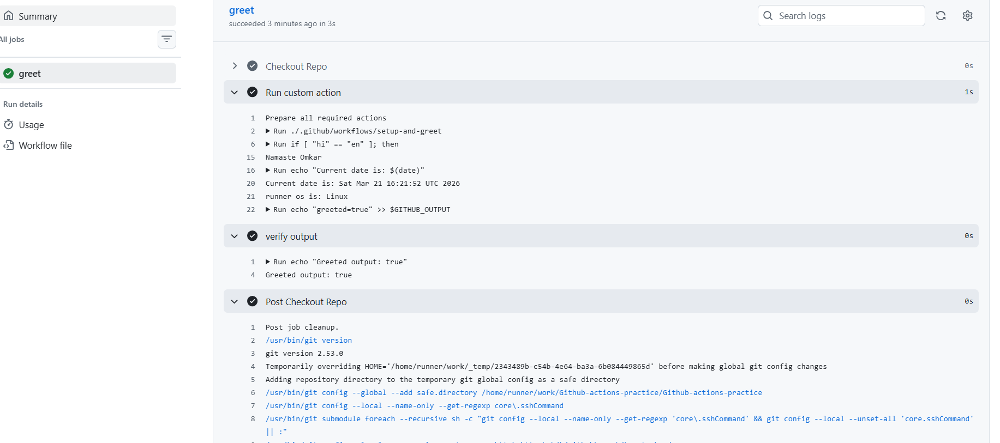
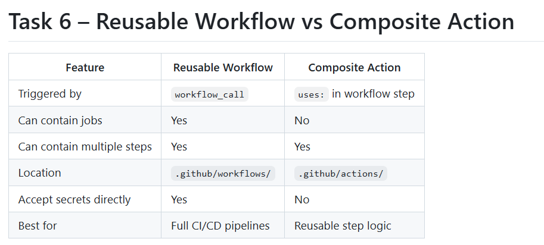

# Day 46 – Reusable Workflows & Composite Actions

## Task
You've been writing workflows from scratch every time. In the real world, teams **don't repeat themselves** — they create reusable workflows that any repo can call like a function. Today you learn `workflow_call` and composite actions.

## Challenge Tasks

### Task 1: Understand `workflow_call`
Before writing any code, research and answer in your notes:
1. What is a reusable workflow?

Ans: A reusable workflow in GitHub Actions is a workflow that can be called from another workflow.

👉 Instead of repeating the same CI/CD steps (build, test, deploy) in multiple workflows, you define them once and reuse them.

Example use case:
Same build process for multiple projects
Standard deployment pipeline across environments

✅ Think of it like a function in programming — write once, use many times.

2. What is the workflow_call trigger?

Ans: The workflow_call trigger allows a workflow to be invoked by another workflow.

📌 It makes a workflow reusable.

Example:

on:
  workflow_call:
    inputs:
      environment:
        required: true
        type: string

👉 This means:
The workflow won’t run on push/pull_request
It only runs when another workflow calls it

3. How is calling a reusable workflow different from using a regular action (uses:)?

Ans: 👉 Simple difference:

Reusable workflow = full pipeline
Action = single task

4. Where must a reusable workflow file live?

Ans: A reusable workflow must be stored in:

.github/workflows/

📌 Example:

.github/workflows/deploy.yml

👉 Only workflows in this directory can be called using workflow_call.

### Task 2: Create Your First Reusable Workflow
Create `.github/workflows/reusable-build.yml`:
1. Set the trigger to `workflow_call`
2. Add an `inputs:` section with:
   - `app_name` (string, required)
   - `environment` (string, required, default: `staging`)
3. Add a `secrets:` section with:
   - `docker_token` (required)
4. Create a job that:
   - Checks out the code
   - Prints `Building <app_name> for <environment>`
   - Prints `Docker token is set: true` (never print the actual secret)

https://github.com/khirappawar1/Github-actions-practice/actions/workflows/reusable-build.yml

**Verify:** This file alone won't run — it needs a caller. That's next.

### Task 3: Create a Caller Workflow
Create `.github/workflows/call-build.yml`:
1. Trigger on push to `main`
2. Add a job that uses your reusable workflow:
   ```yaml
   jobs:
     build:
       uses: ./.github/workflows/reusable-build.yml
       with:
         app_name: "my-web-app"
         environment: "production"
       secrets:
         docker_token: ${{ secrets.DOCKER_TOKEN }}
   ```
3. Push to `main` and watch it run

**Verify:** In the Actions tab, do you see the caller triggering the reusable workflow? Click into the job — can you see the inputs printed? - Yes

https://github.com/khirappawar1/Github-actions-practice/actions/workflows/call-build.yml 



### Task 4: Add Outputs to the Reusable Workflow
Extend `reusable-build.yml`:
1. Add an `outputs:` section that exposes a `build_version` value
2. Inside the job, generate a version string (e.g., `v1.0-<short-sha>`) and set it as output
3. In your caller workflow, add a second job that:
   - Depends on the build job (`needs:`)
   - Reads and prints the `build_version` output

**Verify:** Does the second job print the version from the reusable workflow? 



## Task 5: Create a Composite Action
Create a **custom composite action** in your repo at `.github/actions/setup-and-greet/action.yml`:
1. Define inputs: `name` and `language` (default: `en`)
2. Add steps that:
   - Print a greeting in the specified language
   - Print the current date and runner OS
   - Set an output called `greeted` with value `true`
3. Use the composite action in a new workflow with `uses: ./.github/actions/setup-and-greet`

**Verify:** Does your custom action run and print the greeting?

https://github.com/khirappawar1/Github-actions-practice/blob/main/.github/workflows/use-greet.yml



