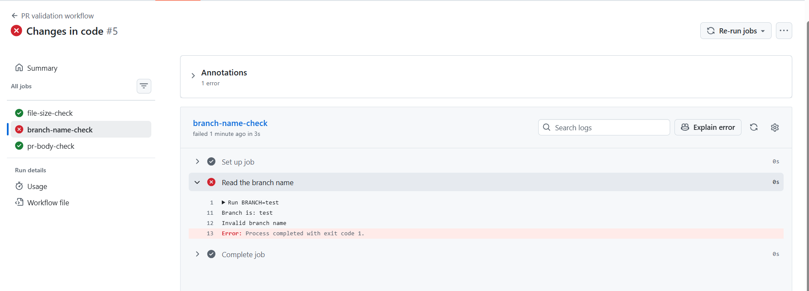

# Day 47 – Advanced Triggers: PR Events, Cron Schedules & Event-Driven Pipelines

## Task
You've used `push` and basic `pull_request` triggers. But GitHub Actions supports **dozens of event types** — today you go deep into PR lifecycle events, scheduled cron jobs, and chaining workflows together.

## Challenge Tasks

### Task 1: Pull Request Event Types
Create `.github/workflows/pr-lifecycle.yml` that triggers on `pull_request` with **specific activity types**:
1. Trigger on: `opened`, `synchronize`, `reopened`, `closed`
2. Add steps that:
   - Print which event type fired: `${{ github.event.action }}`
   - Print the PR title: `${{ github.event.pull_request.title }}`
   - Print the PR author: `${{ github.event.pull_request.user.login }}`
   - Print the source branch and target branch
3. Add a conditional step that only runs when the PR is **merged** (closed + merged = true)

Test it: create a PR, push an update to it, then merge it. Watch the workflow fire each time with a different event type.

## Task 2: PR Validation Workflow
Create `.github/workflows/pr-checks.yml` — a real-world PR gate:
1. Trigger on `pull_request` to `main`
2. Add a job `file-size-check` that:
   - Checks out the code
   - Fails if any file in the PR is larger than 1 MB
3. Add a job `branch-name-check` that:
   - Reads the branch name from `${{ github.head_ref }}`
   - Fails if it doesn't follow the pattern `feature/*`, `fix/*`, or `docs/*`
4. Add a job `pr-body-check` that:
   - Reads the PR body: `${{ github.event.pull_request.body }}`
   - Warns (but doesn't fail) if the PR description is empty

**Verify:** Open a PR from a badly named branch — does the check fail?

---

