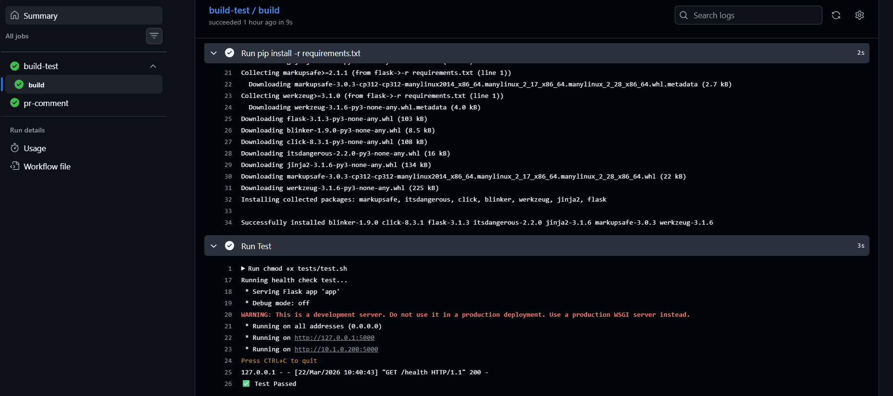
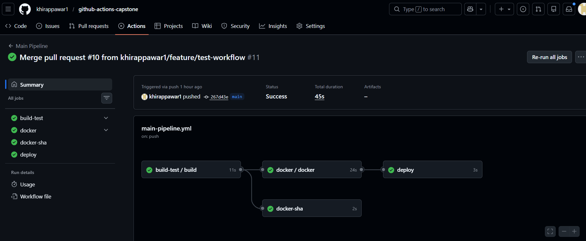

# Day 48 – GitHub Actions Project: End-to-End CI/CD Pipeline

## Task
You've learned workflows, triggers, secrets, Docker builds, reusable workflows, and advanced events. Today you **put it all together** in one project — a complete, production-style CI/CD pipeline that builds, tests, and deploys using everything you've learned from Day 40 to Day 47.

This is your GitHub Actions capstone.

### Task 1: Set Up the Project Repo
1. Create a new repo called `github-actions-capstone` (or use your existing `github-actions-practice`)
2. Add a simple app — pick any one:
   - A Python Flask/FastAPI app with one endpoint
   - A Node.js Express app with one endpoint
   - Your Dockerized app from Day 36
3. Add a `Dockerfile` and a basic test (even a script that curls the health endpoint counts)
4. Add a `README.md` with a project description

### Task 2: Reusable Workflow — Build & Test
Create `.github/workflows/reusable-build-test.yml`:
1. Trigger: `workflow_call`
2. Inputs: `python_version` (or `node_version`), `run_tests` (boolean, default: true)
3. Steps:
   - Check out code
   - Set up the language runtime
   - Install dependencies
   - Run tests (only if `run_tests` is true)
   - Set output: `test_result` with value `passed` or `failed`

This workflow does NOT deploy — it only builds and tests.

https://github.com/khirappawar1/github-actions-capstone/blob/main/.github/workflows/reusable-build-test.yml

### Task 3: Reusable Workflow — Docker Build & Push
Create `.github/workflows/reusable-docker.yml`:
1. Trigger: `workflow_call`
2. Inputs: `image_name` (string), `tag` (string)
3. Secrets: `docker_username`, `docker_token`
4. Steps:
   - Check out code
   - Log in to Docker Hub
   - Build and push the image with the given tag
   - Set output: `image_url` with the full image path

   https://github.com/khirappawar1/github-actions-capstone/blob/main/.github/workflows/reusable-docker.yml

   ### Task 4: PR Pipeline
Create `.github/workflows/pr-pipeline.yml`:
1. Trigger: `pull_request` to `main` (types: `opened`, `synchronize`)
2. Call the reusable build-test workflow:
   - Run tests: `true`
3. Add a standalone job `pr-comment` that:
   - Runs after the build-test job
   - Prints a summary: "PR checks passed for branch: `<branch>`"
4. Do **NOT** build or push Docker images on PRs

**Verify:** Open a PR — does it run tests only (no Docker push)?

https://github.com/khirappawar1/github-actions-capstone/blob/main/.github/workflows/Pr-pipeline.yml



### Task 5: Main Branch Pipeline
Create `.github/workflows/main-pipeline.yml`:
1. Trigger: `push` to `main`
2. Job 1: Call the reusable build-test workflow
3. Job 2 (depends on Job 1): Call the reusable Docker workflow
   - Tag: `latest` and `sha-<short-commit-hash>`
4. Job 3 (depends on Job 2): `deploy` job that:
   - Prints "Deploying image: `<image_url>` to production"
   - Uses `environment: production` (set this up in repo Settings → Environments)
   - Requires manual approval if you've set up environment protection rules

**Verify:** Merge a PR to `main` — does it run tests → build Docker → deploy in sequence

https://github.com/khirappawar1/github-actions-capstone/blob/main/.github/workflows/main-pipeline.yml



### Task 6: Scheduled Health Check
Create `.github/workflows/health-check.yml`:
1. Trigger: `schedule` with cron `'0 */12 * * *'` (every 12 hours) + `workflow_dispatch` for manual testing
2. Steps:
   - Pull your latest Docker image
   - Run the container in detached mode
   - Wait 5 seconds, then curl the health endpoint
   - Print pass/fail based on the response
   - Stop and remove the container
3. Add a step that creates a summary using `$GITHUB_STEP_SUMMARY`:
   ```bash
   echo "## Health Check Report" >> $GITHUB_STEP_SUMMARY
   echo "- Image: myapp:latest" >> $GITHUB_STEP_SUMMARY
   echo "- Status: PASSED" >> $GITHUB_STEP_SUMMARY
   echo "- Time: $(date)" >> $GITHUB_STEP_SUMMARY

   https://github.com/khirappawar1/github-actions-capstone/blob/main/.github/workflows/health-check.yml

   ### Task 7: Add Badges & Documentation
1. Add status badges for all your workflows to the repo `README.md`
2. Add a **pipeline architecture diagram** in your notes — draw (or describe) the flow:
   ```
   PR opened → build & test → PR checks pass
   Merge to main → build & test → Docker build & push → deploy
   Every 12 hours → health check
   ```
3. Fill in your notes: What would you add next? (Slack notifications? Multi-environment? Rollback?)

                ┌────────────────────┐
                │   Pull Request     │
                └─────────┬──────────┘
                          │
                          ▼
                ┌────────────────────┐
                │  Build & Test      │
                └─────────┬──────────┘
                          │
                          ▼
                ┌────────────────────┐
                │  PR Checks Pass    │
                └────────────────────┘


                ┌────────────────────┐
                │   Merge to Main    │
                └─────────┬──────────┘
                          │
                          ▼
                ┌────────────────────┐
                │  Build & Test      │
                └─────────┬──────────┘
                          │
                          ▼
                ┌────────────────────┐
                │ Docker Build & Push│
                └─────────┬──────────┘
                          │
                          ▼
                ┌────────────────────┐
                │     Deploy         │
                └────────────────────┘


        ┌──────────────────────────────────────┐
        │   Scheduled (Every 12 hours)         │
        └──────────────────────────────────────┘
                          │
                          ▼
                ┌────────────────────┐
                │  Health Check      │
                └────────────────────┘