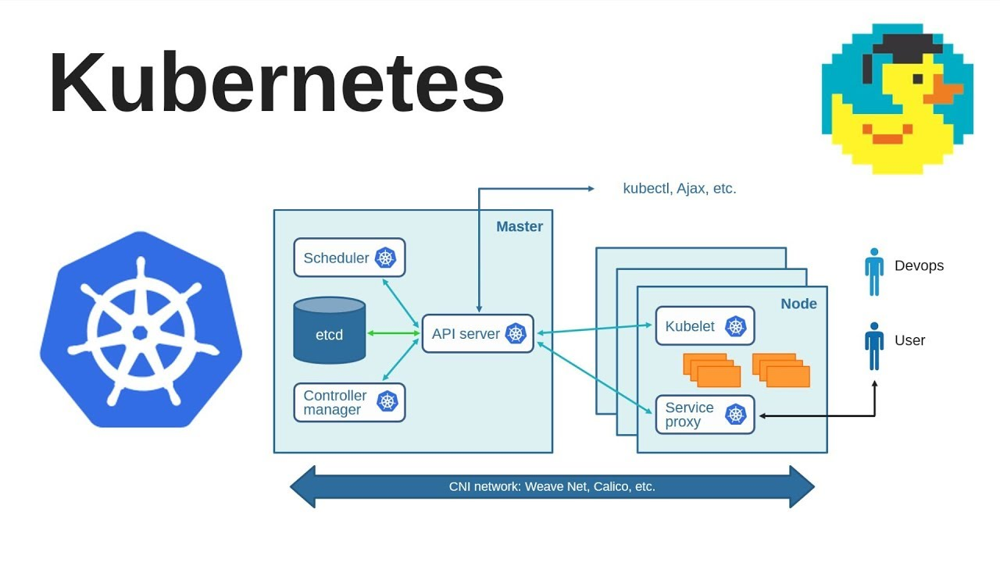

# Day 50 – Kubernetes Architecture and Cluster Setup

## Challenge Tasks

### Task 1: Recall the Kubernetes Story

```bash
1. Why was Kubernetes created? What problem does it solve that Docker alone cannot?

Answer:Kubernetes (K8s) was created to automate deployment, scaling, and management of containerized applications.

While Docker helps you create and run containers, it does not handle large-scale orchestration.

🔥 Problem with Docker alone:
No automatic scaling
No self-healing (restart failed containers)
No built-in load balancing
Hard to manage multiple containers across many servers
Manual deployment and updates
🚀 What Kubernetes solves:
Auto-scaling (based on traffic/load)
Self-healing (restarts failed containers)
Load balancing & service discovery
Rolling updates & rollbacks
Cluster management (multiple nodes)

👉 In short:
Docker = Containerization
Kubernetes = Container Orchestration at scale

2. Who created Kubernetes and what was it inspired by?


Answer:Kubernetes was originally created by Google in 2014.It was inspired by Google’s internal system called Borg, which managed containers at massive scale inside Google.

Later, Google donated Kubernetes to the Cloud Native Computing Foundation, which is part of the Linux Foundation.

3. What does the name "Kubernetes" mean?


Answer: “Kubernetes” comes from a Greek word meaning:

👉 “Helmsman” or “Ship Pilot”

💡 It represents:

Steering containers (like a ship)
Managing and navigating workloads across infrastructure

That’s why you’ll often see ship/helm symbolism in Kubernetes logos and tools (like Helm).

🔥 Final Interview-Ready Version (Short Form)

If interviewer asks, you can say:

Answer: Kubernetes was created by Google in 2014 to solve the problem of managing containerized applications at scale. While Docker helps in running containers, it does not provide orchestration features like auto-scaling, self-healing, and load balancing. Kubernetes, inspired by Google’s Borg system, automates deployment and management of containers across clusters. The name Kubernetes means “helmsman” or “pilot,” representing how it steers containerized applications.
```

### Task 2: Draw the Kubernetes Architecture
From memory, draw or describe the Kubernetes architecture. Your diagram should include:

**Control Plane (Master Node):**
- API Server — the front door to the cluster, every command goes through it
- etcd — the database that stores all cluster state
- Scheduler — decides which node a new pod should run on
- Controller Manager — watches the cluster and makes sure the desired state matches reality

*Worker Node:**
- kubelet — the agent on each node that talks to the API server and manages pods
- kube-proxy — handles networking rules so pods can communicate
- Container Runtime — the engine that actually runs containers (containerd, CRI-O)

 

```bash
1. What happens when you run kubectl apply -f pod.yaml?

Ans:
kubectl sends request to API Server
API Server:
Validates request
Stores desired state in etcd
Scheduler:
Picks a suitable worker node
Kubelet (on that node):
Pulls container image
Starts container via container runtime (Docker/containerd)
Controllers:
Continuously ensure desired state = actual state

👉 Flow:
kubectl → API Server → etcd → Scheduler → Kubelet → Pod running

2. What happens if the API Server goes down?

Ans: Cluster becomes unmanageable
No new deployments/updates (kubectl won’t work)
Existing pods keep running
Controllers stop reconciling state

👉 In short: Cluster runs, but no control plane operations

3. What happens if a worker node goes down?

Ans: Pods on that node become unavailable
Node marked NotReady
Controller detects failure
Scheduler creates new pods on other healthy nodes

👉 In short: Self-healing kicks in (pods recreated elsewhere)
```
