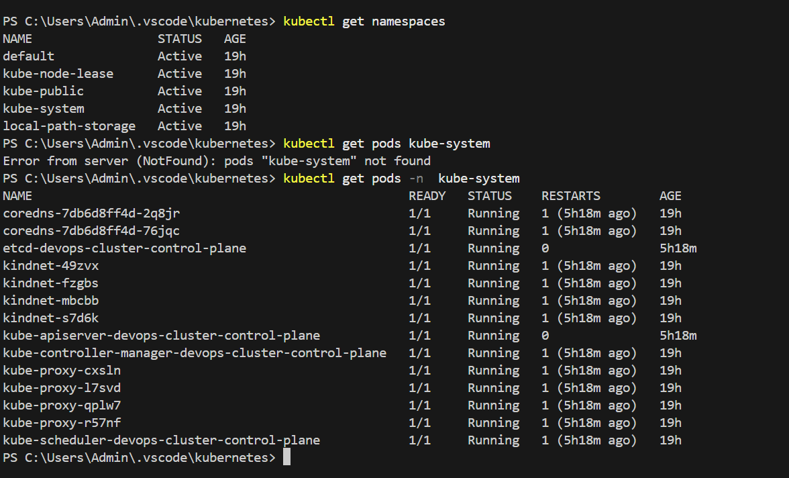
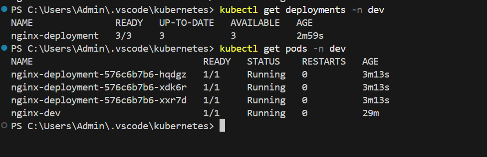
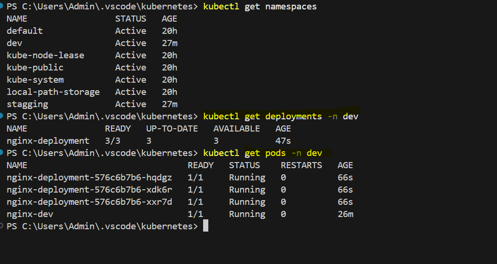
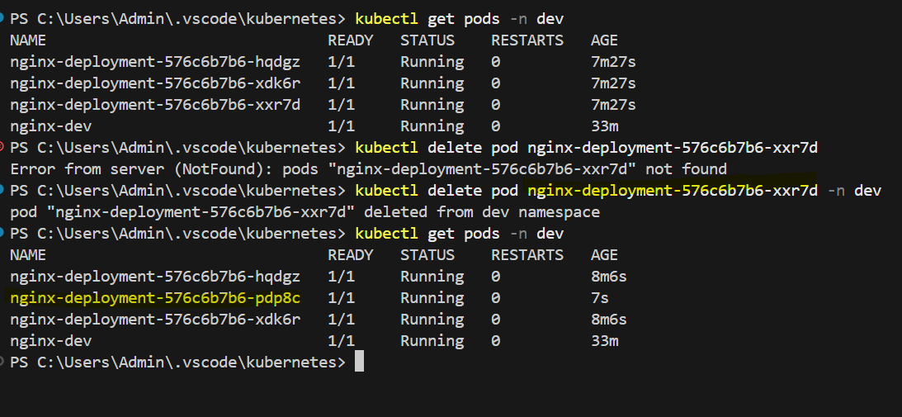
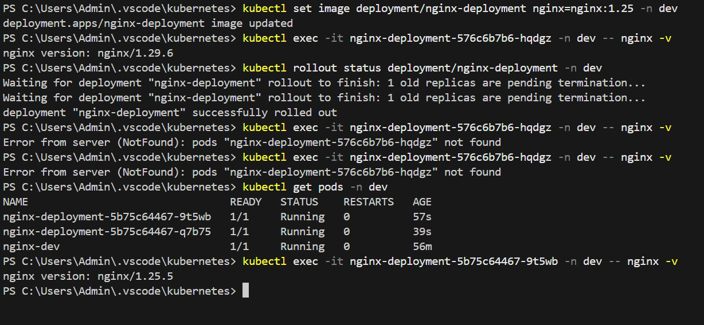
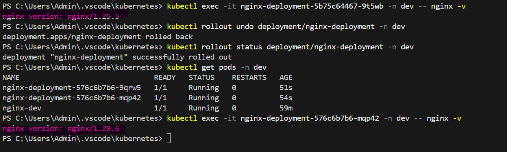
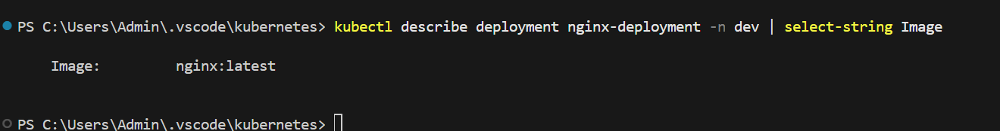
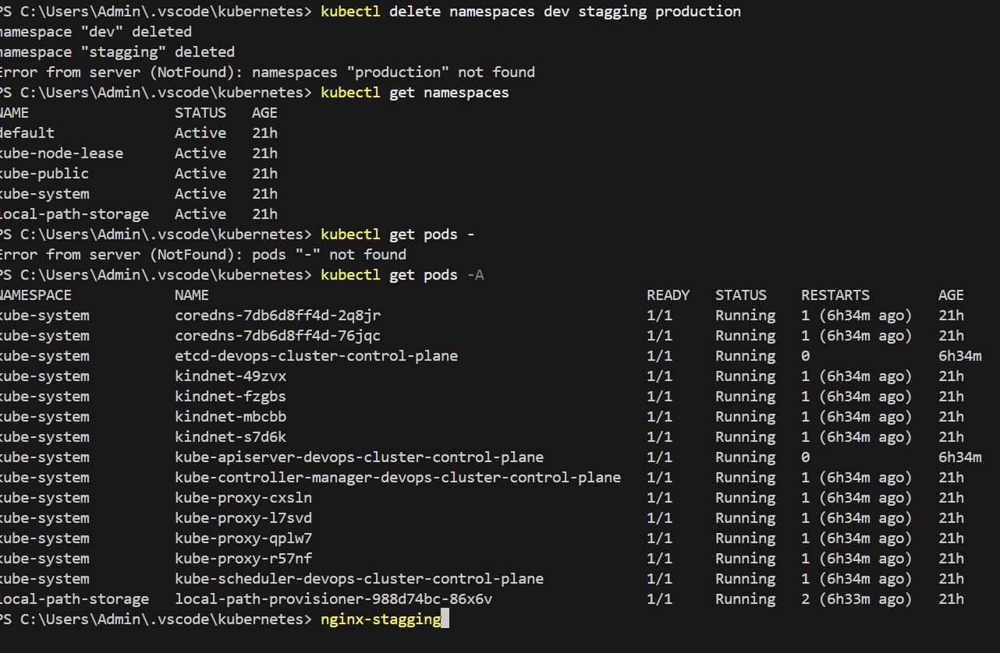

# Day 52 – Kubernetes Namespaces and Deployments

## Task
Yesterday you created standalone Pods. The problem? Delete a Pod and it is gone forever — no one recreates it. Today you fix that with Deployments, the real way to run applications in Kubernetes. You will also learn Namespaces, which let you organize and isolate resources inside a cluster.

---
## Challenge Tasks

### Task 1: Explore Default Namespaces
Kubernetes comes with built-in namespaces. List them:

```bash
kubectl get namespaces
```

You should see at least:
- `default` — where your resources go if you do not specify a namespace
- `kube-system` — Kubernetes internal components (API server, scheduler, etc.)
- `kube-public` — publicly readable resources
- `kube-node-lease` — node heartbeat tracking

Check what is running inside `kube-system`:
```bash
kubectl get pods -n kube-system
```


These are the control plane components keeping your cluster alive. Do not touch them.
```bash
**Verify:** How many pods are running in `kube-system`?

Ans: kubectl get pods -n kube-system - You will see near about 12-13 poda are in running state. These are the control plane components keeping your cluster alive. 
```
---
### Task 2: Create and Use Custom Namespaces
Create two namespaces — one for a development environment and one for staging:

```bash
kubectl create namespace dev
kubectl create namespace staging
```

Verify they exist:
```bash
kubectl get namespaces
```

You can also create a namespace from a manifest:
```yaml
# namespace.yaml
apiVersion: v1
kind: Namespace
metadata:
  name: production
```

```bash
kubectl apply -f namespace.yaml
```

Now run a pod in a specific namespace:
```bash
kubectl run nginx-dev --image=nginx:latest -n dev
kubectl run nginx-staging --image=nginx:latest -n staging
```

List pods across all namespaces:
```bash
kubectl get pods -A
```

Notice that `kubectl get pods` without `-n` only shows the `default` namespace. You must specify `-n <namespace>` or use `-A` to see everything.


```bash
Ans:
PS C:\Users\Admin\.vscode\kubernetes> kubectl create namespaces dev
error: Unexpected args: [namespaces dev]
See 'kubectl create -h' for help and examples
PS C:\Users\Admin\.vscode\kubernetes> kubectl create namespace dev 
namespace/dev created
PS C:\Users\Admin\.vscode\kubernetes> kubectl create namespace stagging
namespace/stagging created
PS C:\Users\Admin\.vscode\kubernetes> kubectl get namespaces
NAME                 STATUS   AGE
default              Active   20h
dev                  Active   19s
kube-node-lease      Active   20h
kube-public          Active   20h
kube-system          Active   20h
local-path-storage   Active   20h
stagging             Active   10s
PS C:\Users\Admin\.vscode\kubernetes> kubectl run nginx-dev --image=nginx:latest -n dev
pod/nginx-dev created
PS C:\Users\Admin\.vscode\kubernetes> kubectl run nginx-stagging --image=nginx:latest -n stagging 
pod/nginx-stagging created
PS C:\Users\Admin\.vscode\kubernetes> kubectl get pods
No resources found in default namespace.
PS C:\Users\Admin\.vscode\kubernetes> kubectl get pods -A
NAMESPACE            NAME                                                   READY   STATUS    RESTARTS        AGE
dev                  nginx-dev                                              1/1     Running   0               57s
kube-system          coredns-7db6d8ff4d-2q8jr                               1/1     Running   1 (5h24m ago)   20h
kube-system          coredns-7db6d8ff4d-76jqc                               1/1     Running   1 (5h24m ago)   20h
kube-system          etcd-devops-cluster-control-plane                      1/1     Running   0               5h24m       
kube-system          kindnet-49zvx                                          1/1     Running   1 (5h24m ago)   20h
kube-system          kindnet-fzgbs                                          1/1     Running   1 (5h24m ago)   20h
kube-system          kindnet-mbcbb                                          1/1     Running   1 (5h24m ago)   20h
kube-system          kindnet-s7d6k                                          1/1     Running   1 (5h24m ago)   20h
kube-system          kube-apiserver-devops-cluster-control-plane            1/1     Running   0               5h24m       
kube-system          kube-controller-manager-devops-cluster-control-plane   1/1     Running   1 (5h24m ago)   20h
kube-system          kube-proxy-cxsln                                       1/1     Running   1 (5h24m ago)   20h
kube-system          kube-proxy-l7svd                                       1/1     Running   1 (5h24m ago)   20h
kube-system          kube-proxy-qplw7                                       1/1     Running   1 (5h24m ago)   20h
kube-system          kube-proxy-r57nf                                       1/1     Running   1 (5h24m ago)   20h
kube-system          kube-scheduler-devops-cluster-control-plane            1/1     Running   1 (5h24m ago)   20h
local-path-storage   local-path-provisioner-988d74bc-86x6v                  1/1     Running   2 (5h23m ago)   20h
stagging             nginx-stagging                                         1/1     Running   0               28s
PS C:\Users\Admin\.vscode\kubernetes> kubectl get pods -n 
error: flag needs an argument: 'n' in -n
See 'kubectl get --help' for usage.
PS C:\Users\Admin\.vscode\kubernetes> kubectl get pods -n stagging
NAME             READY   STATUS    RESTARTS   AGE
nginx-stagging   1/1     Running   0          76s
PS C:\Users\Admin\.vscode\kubernetes> kubectl get pods dev
Error from server (NotFound): pods "dev" not found
PS C:\Users\Admin\.vscode\kubernetes> kubectl get pods -n dev 
NAME        READY   STATUS    RESTARTS   AGE
nginx-dev   1/1     Running   0          119s
PS C:\Users\Admin\.vscode\kubernetes> 
```
**Verify:** Does `kubectl get pods` show these pods? What about `kubectl get pods -A`?
```bash
Ans: `kubectl get pod` (shows pods only in the current (default) namespace.)- will not show the pod running inside the namespaces, So we have to use the `kubectl get pods -n <namespace> or kubectl get pods -A` shows pods from all namespaces.
```

### Task 3: Create Your First Deployment
A Deployment tells Kubernetes: "I want X replicas of this Pod running at all times." If a Pod crashes, the Deployment controller recreates it automatically.

Create a file `nginx-deployment.yaml`:

```yaml
apiVersion: apps/v1
kind: Deployment
metadata:
  name: nginx-deployment
  namespace: dev
  labels:
    app: nginx
spec:
  replicas: 3
  selector:
    matchLabels:
      app: nginx
  template:
    metadata:
      labels:
        app: nginx
    spec:
      containers:
      - name: nginx
        image: nginx:1.24
        ports:
        - containerPort: 80
```

Key differences from a standalone Pod:
- `kind: Deployment` instead of `kind: Pod`
- `apiVersion: apps/v1` instead of `v1`
- `replicas: 3` tells Kubernetes to maintain 3 identical pods
- `selector.matchLabels` connects the Deployment to its Pods
- `template` is the Pod template — the Deployment creates Pods using this blueprint

Apply it:
```bash
kubectl apply -f nginx-deployment.yaml
```

Check the result:
```bash
kubectl get deployments -n dev
kubectl get pods -n dev
```

You should see 3 pods with names like `nginx-deployment-xxxxx-yyyyy`.
```bash
**Verify:** What do the READY, UP-TO-DATE, and AVAILABLE columns mean in the deployment output?

Ans: 🚀 Final Interview Answer

READY shows how many pods are ready out of desired, UP-TO-DATE shows pods running the latest configuration, and AVAILABLE shows pods ready to serve traffic without disruption.
```
---




---

### Task 4: Self-Healing — Delete a Pod and Watch It Come Back
This is the key difference between a Deployment and a standalone Pod.

```bash
# List pods
kubectl get pods -n dev

# Delete one of the deployment's pods (use an actual pod name from your output)
kubectl delete pod <pod-name> -n dev

# Immediately check again
kubectl get pods -n dev
```

The Deployment controller detects that only 2 of 3 desired replicas exist and immediately creates a new one. The deleted pod is replaced within seconds.  

Ans: Yes, When I deleted the running pod inside the dev namespace then control pklane automatically created the new pod that replaaces the deleted pod. 

**Verify:** Is the replacement pod's name the same as the one you deleted, or different?


---

### Task 5: Scale the Deployment
Change the number of replicas:

```bash
# Scale up to 5
kubectl scale deployment nginx-deployment --replicas=5 -n dev
kubectl get pods -n dev

# Scale down to 2
kubectl scale deployment nginx-deployment --replicas=2 -n dev
kubectl get pods -n dev
```

Watch how Kubernetes creates or terminates pods to match the desired count.

You can also scale by editing the manifest — change `replicas: 4` in your YAML file and run `kubectl apply -f nginx-deployment.yaml` again.

**Verify:** When you scaled down from 5 to 2, what happened to the extra pods?
```bash
🎯 One-line Interview Answer

When scaling down, Kubernetes terminates the extra pods gracefully to match the desired replica count.
```
---
### Task 6: Rolling Update
Update the Nginx image version to trigger a rolling update:

```bash
kubectl set image deployment/nginx-deployment nginx=nginx:1.25 -n dev
```

Watch the rollout in real time:
```bash
kubectl rollout status deployment/nginx-deployment -n dev
```

Kubernetes replaces pods one by one — old pods are terminated only after new ones are healthy. This means zero downtime.

Check the rollout history:
```bash
kubectl rollout history deployment/nginx-deployment -n dev
```


Now roll back to the previous version:
```bash
kubectl rollout undo deployment/nginx-deployment -n dev
kubectl rollout status deployment/nginx-deployment -n dev
```


Verify the image is back to the previous version:
```bash
kubectl describe deployment nginx-deployment -n dev | grep Image
```
 

**Verify:** What image version is running after the rollback?

Ans: nginx version: nginx/1.29.6
---

### Task 7: Clean Up
```bash
kubectl delete deployment nginx-deployment -n dev
kubectl delete pod nginx-dev -n dev
kubectl delete pod nginx-staging -n staging
kubectl delete namespace dev staging production
```

Deleting a namespace removes everything inside it. Be very careful with this in production.

```bash
kubectl get namespaces
kubectl get pods -A
```

**Verify:** Are all your resources gone? -- Yes, deleted all the namespaces,deployments and pods.



# Hints
- `kubectl get <resource> -n <namespace>` — target a specific namespace
- `kubectl get <resource> -A` — list resources across all namespaces
- `selector.matchLabels` in a Deployment must match `template.metadata.labels` — if they do not match, the Deployment will not manage the Pods
- `kubectl scale deployment <name> --replicas=N` — quick way to scale
- `kubectl set image` updates a container image without editing the YAML
- `kubectl rollout undo` rolls back to the previous revision
- `kubectl rollout history` shows past revisions of a Deployment
- Deployments create ReplicaSets behind the scenes — you can see them with `kubectl get replicasets -n <namespace>`
