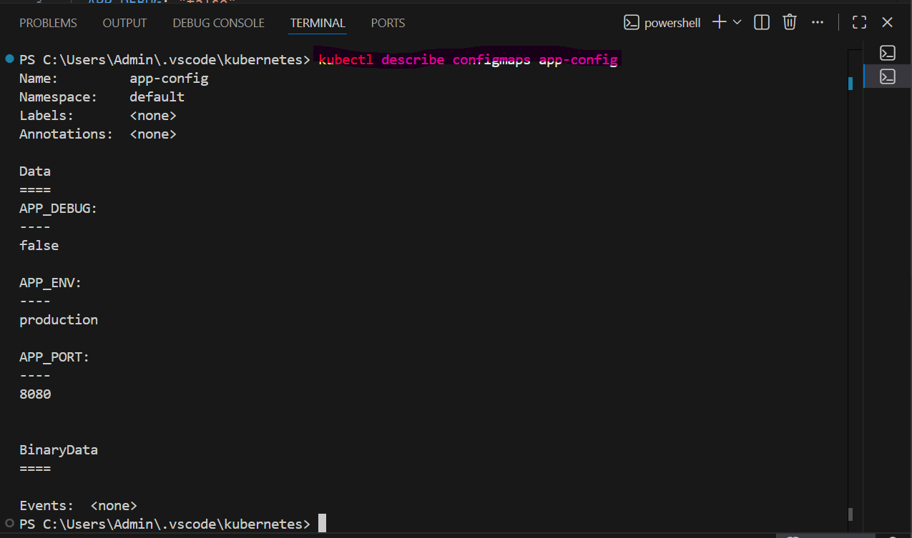
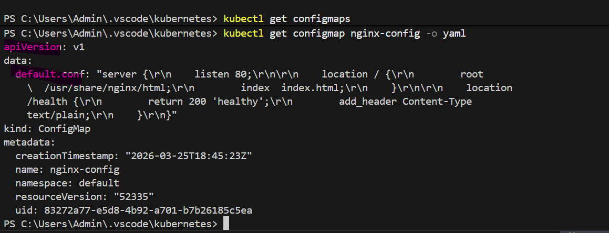
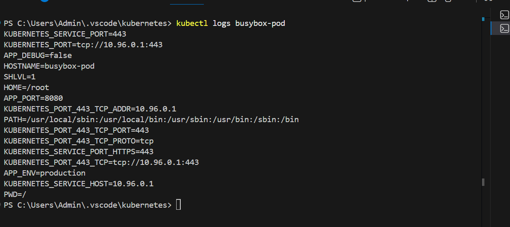
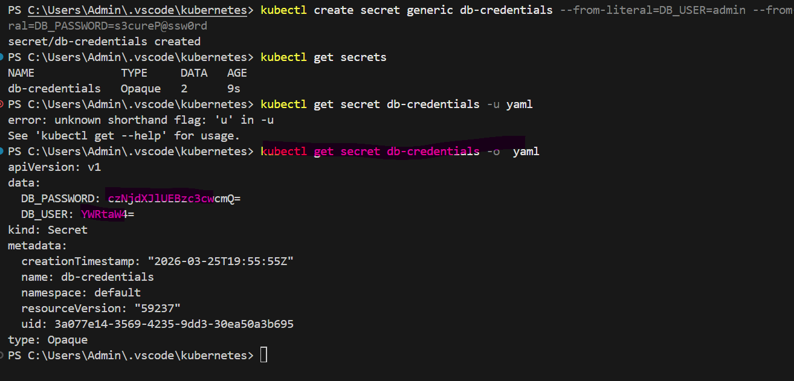
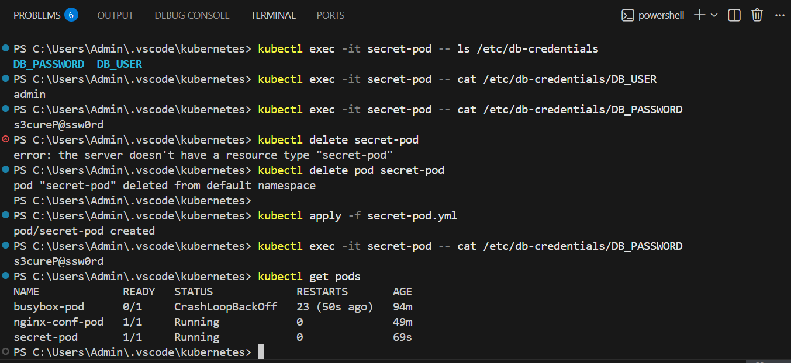
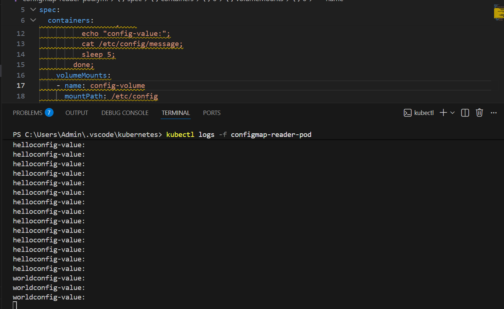

# Day 54 – Kubernetes ConfigMaps and Secrets

## Task
Your application needs configuration — database URLs, feature flags, API keys. Hardcoding these into container images means rebuilding every time a value changes. Kubernetes solves this with ConfigMaps for non-sensitive config and Secrets for sensitive data.

## Challenge Tasks

### Task 1: Create a ConfigMap from Literals
1. Use `kubectl create configmap` with `--from-literal` to create a ConfigMap called `app-config` with keys `APP_ENV=production`, `APP_DEBUG=false`, and `APP_PORT=8080`
2. Inspect it with `kubectl describe configmap app-config` and `kubectl get configmap app-config -o yaml` 



3. Notice the data is stored as plain text — no encoding, no encryption - Yes stored in plain text. 
Y
**Verify:** Can you see all three key-value pairs?
Ans: ``kubectl get configmaps app-config -o yaml >app-config`` By using this command we can get the yaml file into local system.

## Key Observation
Values are stored as plain text
No base64 encoding (unlike Secrets)
No encryption by default
---

### Task 2: Create a ConfigMap from a File
1. Write a custom Nginx config file that adds a `/health` endpoint returning "healthy"
2. Create a ConfigMap from this file using `kubectl create configmap nginx-config --from-file=default.conf=<your-file>`



3. The key name (`default.conf`) becomes the filename when mounted into a Pod

**Verify:** Does `kubectl get configmap nginx-config -o yaml` show the file contents?


### Task 3: Use ConfigMaps in a Pod
1. Write a Pod manifest that uses `envFrom` with `configMapRef` to inject all keys from `app-config` as environment variables. Use a busybox container that prints the values.



2. Write a second Pod manifest that mounts `nginx-config` as a volume at `/etc/nginx/conf.d`. Use the nginx image.
3. Test that the mounted config works: `kubectl exec <pod> -- curl -s http://localhost/health`

Ans:
```bash
kubectl apply -f nginx-conf-pod.yml  
pod/nginx-conf-pod created
PS C:\Users\Admin\.vscode\kubernetes> kubectl get pods
NAME             READY   STATUS             RESTARTS         AGE
busybox-pod      0/1     CrashLoopBackOff   13 (2m54s ago)   44m
nginx-conf-pod   1/1     Running            0                5s
PS C:\Users\Admin\.vscode\kubernetes> kubectl exec -it nginx-conf-pod -- ls /etc/nginx/conf.d
default.conf
PS C:\Users\Admin\.vscode\kubernetes> kubectl exec -it nginx-conf-pod -- cat /etc/nginx/conf.d/default.conf
server {
    listen 80;

    location /health {
        return 200 'healthy';
        add_header Content-Type text/plain;
    }
}
PS C:\Users\Admin\.vscode\kubernetes> kubectl exec nginx-conf-pod -- curl -s http://localhost/health
healthy
PS C:\Users\Admin\.vscode\kubernetes> kubectl describe pod nginx-conf-pod
Name:             nginx-conf-pod
Namespace:        default
Priority:         0
Service Account:  default
Node:             devops-cluster-worker/172.18.0.4
Start Time:       Thu, 26 Mar 2026 01:20:39 +0530
Labels:           <none>
Annotations:      <none>
Status:           Running
IP:               10.244.2.4
IPs:
  IP:  10.244.2.4
Containers:
  nginx:
    Container ID:   containerd://9d4a479c46f421e6d83636f392380db725ec7aee3396c570d86042300739bf66
    Image:          nginx
    Image ID:       docker.io/library/nginx@sha256:7150b3a39203cb5bee612ff4a9d18774f8c7caf6399d6e8985e97e28eb751c18        
    Port:           <none>
    Host Port:      <none>
    State:          Running
      Started:      Thu, 26 Mar 2026 01:20:41 +0530
    Ready:          True
    Restart Count:  0
    Environment:    <none>
    Mounts:
      /etc/nginx/conf.d from nginx-config-volume (rw)
      /var/run/secrets/kubernetes.io/serviceaccount from kube-api-access-ncccf (ro)
Conditions:
  Type                        Status
  PodReadyToStartContainers   True
  Initialized                 True
  Ready                       True
  ContainersReady             True
  PodScheduled                True
Volumes:
  nginx-config-volume:
    Type:      ConfigMap (a volume populated by a ConfigMap)
    Name:      nginx-config
    Optional:  false
  kube-api-access-ncccf:
    Type:                    Projected (a volume that contains injected data from multiple sources)
    TokenExpirationSeconds:  3607
    ConfigMapName:           kube-root-ca.crt
    Optional:                false
    DownwardAPI:             true
QoS Class:                   BestEffort
Node-Selectors:              <none>
Tolerations:                 node.kubernetes.io/not-ready:NoExecute op=Exists for 300s
                             node.kubernetes.io/unreachable:NoExecute op=Exists for 300s
Events:
  Type    Reason     Age   From               Message
  ----    ------     ----  ----               -------
  Normal  Scheduled  68s   default-scheduler  Successfully assigned default/nginx-conf-pod to devops-cluster-worker        
  Normal  Pulling    68s   kubelet            Pulling image "nginx"
  Normal  Pulled     66s   kubelet            Successfully pulled image "nginx" in 1.393s (1.393s including waiting). Image size: 62958873 bytes.
  Normal  Created    66s   kubelet            Created container nginx
  Normal  Started    66s   kubelet            Started container nginx
  ```

Use environment variables for simple key-value settings. Use volume mounts for full config files.

**Verify:** Does the `/health` endpoint respond? -- Yes


### Task 4: Create a Secret
1. Use `kubectl create secret generic db-credentials` with `--from-literal` to store `DB_USER=admin` and `DB_PASSWORD=s3cureP@ssw0rd`
2. Inspect with `kubectl get secret db-credentials -o yaml` — the values are base64-encoded
3. Decode a value: `echo '<base64-value>' | base64 --decode`



**base64 is encoding, not encryption.** Anyone with cluster access can decode Secrets. The real advantages are RBAC separation, tmpfs storage on nodes, and optional encryption at rest.

**Verify:** Can you decode the password back to plaintext?

### Task 5: Use Secrets in a Pod
1. Write a Pod manifest that injects `DB_USER` as an environment variable using `secretKeyRef`
2. In the same Pod, mount the entire `db-credentials` Secret as a volume at `/etc/db-credentials` with `readOnly: true`
3. Verify: each Secret key becomes a file, and the content is the decoded plaintext value

**Verify:** Are the mounted file values plaintext or base64?



### Task 6: Update a ConfigMap and Observe Propagation
1. Create a ConfigMap `live-config` with a key `message=hello`
2. Write a Pod that mounts this ConfigMap as a volume and reads the file in a loop every 5 seconds
3. Update the ConfigMap: `kubectl patch configmap live-config --type merge -p '{"data":{"message":"world"}}'`
4. Wait 30-60 seconds — the volume-mounted value updates automatically
5. Environment variables from earlier tasks do NOT update — they are set at pod startup only

**Verify:** Did the volume-mounted value change without a pod restart?
