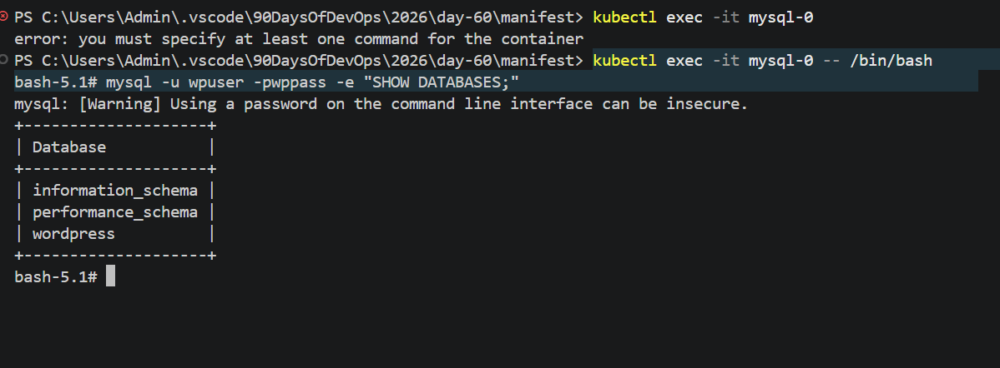
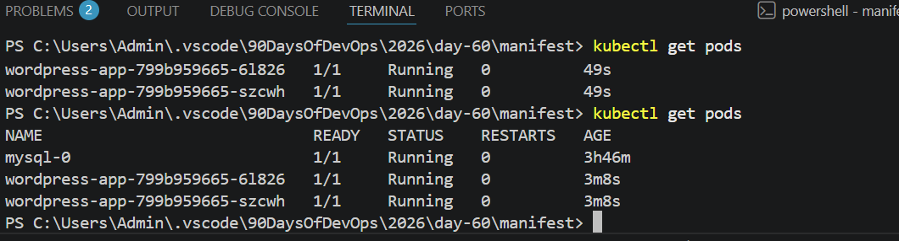

# Day 60 – Capstone: Deploy WordPress + MySQL on Kubernetes

## Task
Ten days of Kubernetes — clusters, Pods, Deployments, Services, ConfigMaps, Secrets, storage, StatefulSets, resource management, autoscaling, and Helm. Today you put it all together. Deploy a real WordPress + MySQL application using every major concept you have learned.

---
## Challenge Tasks

### Task 1: Create the Namespace (Day 52)
1. Create a `capstone` namespace
2. Set it as your default: `kubectl config set-context --current --namespace=capstone`

---
### Task 2: Deploy MySQL (Days 54-56)
1. Create a Secret with `MYSQL_ROOT_PASSWORD`, `MYSQL_DATABASE`, `MYSQL_USER`, and `MYSQL_PASSWORD` using `stringData`
2. Create a Headless Service (`clusterIP: None`) for MySQL on port 3306
3. Create a StatefulSet for MySQL with:
   - Image: `mysql:8.0`
   - `envFrom` referencing the Secret
   - Resource requests (cpu: 250m, memory: 512Mi) and limits (cpu: 500m, memory: 1Gi)
   - A `volumeClaimTemplates` section requesting 1Gi of storage, mounted at `/var/lib/mysql`
4. Verify MySQL works: `kubectl exec -it mysql-0 -- mysql -u <user> -p<password> -e "SHOW DATABASES;"`

**Verify:** Can you see the `wordpress` database? - Yes.

 

### Task 3: Deploy WordPress (Days 52, 54, 57)
1. Create a ConfigMap with `WORDPRESS_DB_HOST` set to `mysql-0.mysql.capstone.svc.cluster.local:3306` and `WORDPRESS_DB_NAME`
2. Create a Deployment with 2 replicas using `wordpress:latest` that:
   - Uses `envFrom` for the ConfigMap
   - Uses `secretKeyRef` for `WORDPRESS_DB_USER` and `WORDPRESS_DB_PASSWORD` from the MySQL Secret
   - Has resource requests and limits
   - Has a liveness probe and readiness probe on `/wp-login.php` port 80
3. Wait until both pods show `1/1 Running`

**Verify:** Are both WordPress pods running and ready? -- Yes

### Task 4: Expose WordPress (Day 53)
1. Create a NodePort Service on port 30080 targeting the WordPress pods
2. Access WordPress in your browser:
   - Minikube: `minikube service wordpress -n capstone`
   - Kind: `kubectl port-forward svc/wordpress 8080:80 -n capstone`
3. Complete the setup wizard and create a blog post

**Verify:** Can you see the WordPress setup page? - Yes

## Task 5: Test Self-Healing and Persistence
1. Delete a WordPress pod — watch the Deployment recreate it within seconds. Refresh the site.
2. Delete the MySQL pod: `kubectl delete pod mysql-0 -n capstone` — watch the StatefulSet recreate it
3. After MySQL recovers, refresh WordPress — your blog post should still be there

**Verify:** After deleting both pods, is your blog post still there? - Yes

### Task 6: Set Up HPA (Day 58)
1. Write an HPA manifest targeting the WordPress Deployment with CPU at 50%, min 2, max 10 replicas
2. Apply and check: `kubectl get hpa -n capstone`
3. Run `kubectl get all -n capstone` for the complete picture

**Verify:** Does the HPA show correct min/max and target? 

---